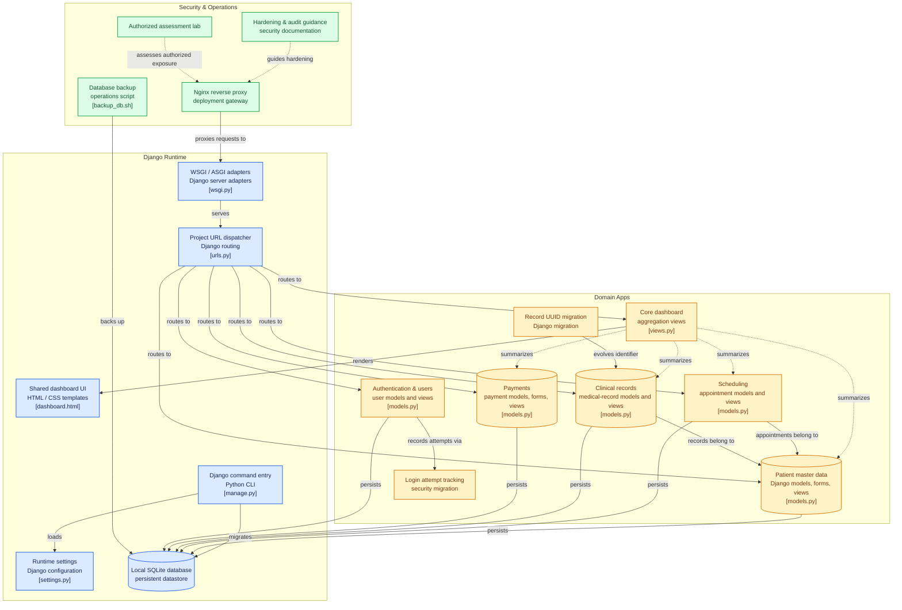

# 🦷🔐 DentalSecureLab

**DentalSecureLab** es una aplicación web educativa desarrollada con **Python y Django** para utilizarse como entorno práctico en el aprendizaje de **seguridad en entornos digitales**.

El proyecto simula un sistema básico de gestión para un consultorio dental y proporciona una infraestructura controlada sobre la cual los estudiantes pueden implementar, configurar y evaluar diferentes mecanismos de seguridad.

> ⚠️ Este proyecto tiene fines exclusivamente educativos.  
> No debe utilizarse para almacenar información clínica, financiera o personal real.

---

## 🎯 Objetivo del proyecto

DentalSecureLab busca proporcionar una aplicación web funcional sobre la cual los estudiantes puedan desarrollar prácticas relacionadas con:

- Configuración de servidores Linux.
- Protección de comunicaciones.
- Implementación de controles de seguridad.
- Hardening de servidores.
- Autenticación y control de acceso.
- Análisis de vulnerabilidades.
- Seguridad de aplicaciones web.
- Pentesting en un entorno controlado.

La aplicación funciona como un **laboratorio progresivo**, por lo que su seguridad será fortalecida conforme avancen las prácticas.

---

## 🏗️ Arquitectura del laboratorio

El laboratorio está pensado para trabajar en equipos de dos estudiantes.

```text
        ESTUDIANTE A                         ESTUDIANTE B
           Laptop                               Laptop
             │                                    │
      Máquina Virtual                      Máquina Virtual
             │                                    │
      Ubuntu Server                          Kali Linux
             │                                    │
      DentalSecureLab                       OWASP ZAP
             │                              Pentesting
      Django + SQLite                            │
             │                                    │
             └────────── RED LOCAL ───────────────┘
                       Router / Switch
```

Durante las primeras etapas del proyecto, DentalSecureLab se instala y configura en **Ubuntu Server**.

Posteriormente, el segundo equipo podrá utilizar herramientas de análisis y pentesting desde **Kali Linux** para evaluar la infraestructura dentro de un entorno autorizado y controlado.

---

## 💻 Tecnologías

### Aplicación

- Python
- Django
- HTML
- CSS
- SQLite

### Infraestructura y seguridad

A lo largo del laboratorio podrán incorporarse tecnologías como:

- Ubuntu Server
- Linux
- Git
- Nginx / Apache
- OpenSSL
- Firewall
- Kali Linux
- OWASP ZAP

---

## 📦 Funcionalidades actuales

DentalSecureLab incluye los siguientes módulos:

### 👤 Pacientes

Permite registrar y consultar pacientes dentro del sistema.

### 📅 Agenda

Permite registrar y administrar citas asociadas con los pacientes.

### 📋 Expedientes

Permite crear expedientes clínicos asociados con los pacientes.

### 💳 Pagos

Permite registrar los pagos realizados y consultar los movimientos almacenados.

### 📊 Dashboard

Presenta información general de los registros existentes en el sistema.

---

# 🚀 Instalación del laboratorio

## 1. Actualizar Ubuntu Server

```bash
sudo apt update
sudo apt upgrade -y
```

---

## 2. Instalar Git y Python

```bash
sudo apt install git python3 python3-pip python3-venv -y
```

Comprobar las instalaciones:

```bash
git --version
python3 --version
```

---

## 3. Clonar DentalSecureLab

```bash
git clone https://github.com/atonaltzin/DentalSecureLab.git
```

Entrar al proyecto:

```bash
cd DentalSecureLab
```

---

## 4. Crear el entorno virtual

```bash
python3 -m venv env
```

Activarlo:

```bash
source env/bin/activate
```

Cuando el entorno esté activo deberá aparecer:

```text
(env)
```

al inicio de la terminal.

---

## 5. Instalar dependencias

```bash
pip install -r requirements.txt
```

---

## 6. Crear la base de datos

La base de datos **no se distribuye dentro del repositorio**.

Cada instalación deberá generar su propia base de datos mediante las migraciones de Django:

```bash
python manage.py migrate
```

Esto generará localmente:

```text
db.sqlite3
```

---

## 7. Crear usuario administrador

```bash
python manage.py createsuperuser
```

Django solicitará los datos necesarios para crear la cuenta administrativa.

---

## 8. Ejecutar DentalSecureLab

Para comprobar inicialmente la instalación:

```bash
python manage.py runserver
```

La aplicación estará disponible localmente en:

```text
http://127.0.0.1:8000
```

> La configuración para permitir el acceso desde otros equipos de la red forma parte de las prácticas del laboratorio y no se encuentra preconfigurada.

---

# 🧪 Preparación del laboratorio

Después de realizar la instalación, cada equipo deberá generar información **completamente ficticia** para trabajar durante las prácticas.

Como conjunto inicial se recomienda registrar:

| Información | Cantidad mínima |
|---|---:|
| Pacientes ficticios | 10 |
| Citas | 10 |
| Expedientes | 10 |
| Pagos | 10 |

**No utilizar datos personales, médicos o financieros reales.**

---

# 🔐 Ruta de aprendizaje

DentalSecureLab está diseñado para evolucionar progresivamente durante el curso.

```text
C1
Protección de comunicaciones
        ↓
C2
Requisitos y controles de seguridad
        ↓
C3
Protección del servidor
        ↓
C4
Usuarios y autenticación
        ↓
C5
Evaluación de seguridad
```

Cada etapa incorpora nuevos controles sobre la misma infraestructura, permitiendo observar la evolución de una aplicación web desde su configuración inicial hasta la evaluación de su seguridad.

---

# ⚠️ Consideraciones de seguridad

DentalSecureLab constituye un **entorno educativo de laboratorio**.

Algunas configuraciones pueden ser deliberadamente básicas o formar parte de ejercicios posteriores de análisis y fortalecimiento.

Las pruebas de seguridad deberán realizarse exclusivamente:

- Sobre infraestructura propia.
- Dentro del laboratorio autorizado.
- Entre los equipos designados para la práctica.
- Con información ficticia.
- Bajo las indicaciones del docente.

Nunca deben realizarse pruebas sobre sistemas, redes, aplicaciones o dispositivos sin autorización.

---

# 📁 Estructura general

```text
DentalSecureLab/
│
├── agenda/
├── config/
├── core/
├── patients/
├── payments/
├── records/
├── users/
│
├── static/
├── templates/
│
├── manage.py
├── requirements.txt
└── .gitignore
```

El entorno virtual y la base de datos se generan localmente y no forman parte del repositorio:

```text
env/
db.sqlite3
```

---

# 📚 Uso educativo

Este proyecto puede utilizarse como apoyo para cursos relacionados con:

- Seguridad en entornos digitales.
- Ciberseguridad.
- Seguridad web.
- Administración de servidores.
- Desarrollo seguro de aplicaciones.
- Fundamentos de pentesting.
- Ingeniería de software.

El proyecto continuará evolucionando conforme se desarrollen nuevas prácticas y materiales educativos.

---

## 👨‍💻 Autor

**José Atonaltzin Maldonado Ortiz**

Docente y profesional del área de Tecnologías de la Información.

Áreas de trabajo e interés:

- Ingeniería de Software
- Desarrollo Web
- Ciberseguridad
- Tecnologías de la Información
- Docencia tecnológica

---

## 🤝 Contribuciones

Las sugerencias, correcciones y mejoras al proyecto son bienvenidas.

Puedes utilizar las herramientas de GitHub para:

- Reportar errores.
- Proponer mejoras.
- Realizar un fork del proyecto.
- Enviar contribuciones mediante Pull Requests.

---

## 📄 Licencia

La licencia de distribución y reutilización del proyecto se encuentra pendiente de definición.

---

**DentalSecureLab**  
*Un laboratorio educativo para aprender seguridad construyendo, protegiendo y evaluando una aplicación web.*

