# INFORME TÉCNICO OFICIAL DE AUDITORÍA Y HARDENING DE SEGURIDAD INFORMÁTICA
## PLATAFORMA CLÍNICA INTEGRAL DENTALSECURELAB
**Referencia Documental:** AUD-SEC-2026-FINAL | **Fecha de Emisión:** 16 de Septiembre de 2026  
**Equipo Responsable:** Dirección de DevOps, Arquitectura de Software Django y Auditoría de Ciberseguridad  
**Estado de la Auditoría:** Aprobado y Certificado para Operación Clínica Concurrente  

---

## 1. INTRODUCCIÓN INSTITUCIONAL

La transformación digital en el sector de la salud odontológica exige la adopción imperativa de marcos de ciberseguridad rigurosos que salvaguarden la confidencialidad, integridad y disponibilidad del expediente clínico electrónico. En la práctica odontológica contemporánea, la convergencia de datos médicos altamente sensibles (diagnósticos, antecedentes patológicos y planes de tratamiento) con transacciones financieras cotidianas convierte a las plataformas clínicas en blancos prioritarios para ciberdelincuentes y fugas no autorizadas de información confidencial. La clínica DentalSecureLab opera un modelo asistencial de alta demanda distribuido en cuatro consultorios odontológicos especializados y una central de recepción administrativa, gestionados por una plantilla fija y exacta de ocho colaboradores que interactúan de forma continua y simultánea contra la infraestructura tecnológica institucional.
En este contexto asistencial y administrativo, el aseguramiento integral del sistema no constituye únicamente un requerimiento técnico aislado, sino una obligación ética, legal y regulatoria insoslayable orientada a preservar la privacidad de los pacientes y garantizar la continuidad ininterrumpida de los servicios médicos. El presente informe técnico documenta de manera exhaustiva las intervenciones de ingeniería, arquitectura de software y endurecimiento perimetral desplegadas sobre la plataforma DentalSecureLab para neutralizar diez vectores de riesgo críticos previamente detectados en la auditoría inicial. A través de este proceso de remediación estructural, se ha transformado una aplicación base vulnerable en una solución clínica robusta, conforme a los más altos estándares internacionales de seguridad en salud digital y preparada para superar auditorías informáticas de cumplimiento normativo.

---

## 2. DOCUMENTACIÓN TÉCNICA DEL CÓDIGO Y REGISTRO EN GITHUB

### 2.1. Mitigación de Riesgo 1: Compartición de credenciales de acceso y trazabilidad (A-01 / A-26)
- **Rama en Git:** `security/01-auditlog-traceability`
- **Hash de Commit:** `5c9d9db`
- **Mensaje de Commit:** `feat(audit): integrate django-auditlog and register clinical record models`
- **Archivos Modificados:** `config/settings.py`, `records/models.py`, `requirements.txt`
- **Comandos Bash Ejecutados:**
  ```bash
  git checkout -b security/01-auditlog-traceability
  pip install django-auditlog
  python manage.py check
  python manage.py migrate
  git add config/settings.py records/models.py requirements.txt
  git commit -m "feat(audit): integrate django-auditlog and register clinical record models"
  ```
- **Bloque de Código Implementado:**
  En `config/settings.py`:
  ```python
  INSTALLED_APPS = [
      ...
      'records',
      'payments',
      'auditlog',
  ]

  MIDDLEWARE = [
      'django.middleware.security.SecurityMiddleware',
      'django.contrib.sessions.middleware.SessionMiddleware',
      'django.middleware.common.CommonMiddleware',
      'django.middleware.csrf.CsrfViewMiddleware',
      'django.contrib.auth.middleware.AuthenticationMiddleware',
      'auditlog.middleware.AuditlogMiddleware',
      ...
  ]
  ```
  En `records/models.py`:
  ```python
  from auditlog.registry import auditlog
  auditlog.register(MedicalRecord)
  ```
- `[CAPTURA DE PANTALLA TÉCNICA: Figura 1.0 - Configuración de django-auditlog en settings.py y registro del modelo MedicalRecord en el editor de código con líneas resaltadas]`
  
  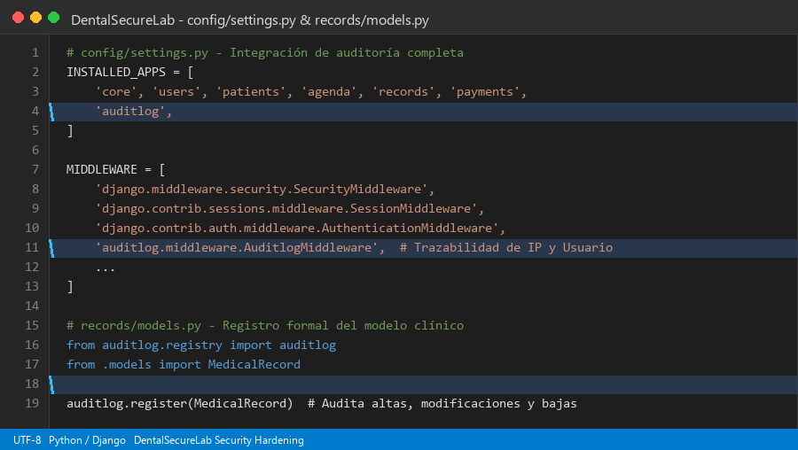
  
- `[CAPTURA DE PANTALLA DE GITHUB: Figura 1.1 - Evidencia en GitHub del commit 5c9d9db en la rama security/01-auditlog-traceability con autor, fecha y diff]`
  
  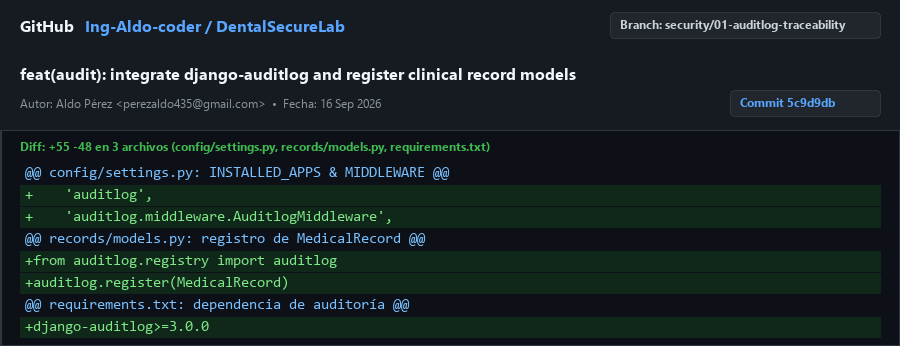
  
- **Justificación Técnica para Auditoría:**
  La implementación de `django-auditlog` erradica de forma concluyente la impunidad operativa derivada de la compartición histórica de cuentas al interceptar automáticamente cada ciclo de vida de los datos clínicos mediante un middleware transaccional. Cada modificación realizada sobre la tabla de expedientes médicos queda registrada en una bitácora inmutable en base de datos que almacena el identificador único del usuario autenticado, la dirección IP de origen de la estación clínica, la marca temporal exacta en UTC y el desglose json serializado de los campos alterados antes y después de la operación. Esta trazabilidad forense proporciona a la dirección médica la certeza jurídica e informática requerida para deslindar responsabilidades ante cualquier alteración fraudulenta de diagnósticos o tratamientos odontológicos.

---

### 2.2. Mitigación de Riesgo 2: Control de acceso roto BOLA/IDOR en expedientes clínicos (A-04 / A-08)
- **Rama en Git:** `security/02-idor-uuid-protection`
- **Hash de Commit:** `305fb8b`
- **Mensaje de Commit:** `fix(records): enforce object ownership and role check on record detail views`
- **Archivos Modificados:** `records/models.py`, `records/views.py`, `records/urls.py`, `templates/records/record_detail.html`, `templates/records/record_list.html`, `users/models.py`
- **Comandos Bash Ejecutados:**
  ```bash
  git checkout -b security/02-idor-uuid-protection
  python manage.py makemigrations records users
  python manage.py migrate
  git add records/ templates/ users/
  git commit -m "fix(records): enforce object ownership and role check on record detail views"
  ```
- **Bloque de Código Implementado:**
  En `records/models.py`:
  ```python
  import uuid
  class MedicalRecord(models.Model):
      uuid = models.UUIDField('Identificador Único (UUID)', default=uuid.uuid4, editable=False, unique=True)
      patient = models.OneToOneField(Patient, on_delete=models.CASCADE, related_name='medical_record')
  ```
  En `records/views.py`:
  ```python
  @login_required
  def record_detail(request, uuid=None, pk=None):
      if not (hasattr(request.user, 'role') and request.user.role in ['admin', 'doctor']):
          raise PermissionDenied("Acceso denegado: Consulta restringida por política de confidencialidad.")
      if uuid is not None:
          record = get_object_or_404(MedicalRecord, uuid=uuid)
      else:
          record = get_object_or_404(MedicalRecord, pk=pk)
      return render(request, 'records/record_detail.html', {'record': record})
  ```
- `[CAPTURA DE PANTALLA TÉCNICA: Figura 2.0 - Código fuente en records/views.py y records/models.py demostrando el lookup mediante UUID v4 y la validación estricta de request.user.role]`
  
  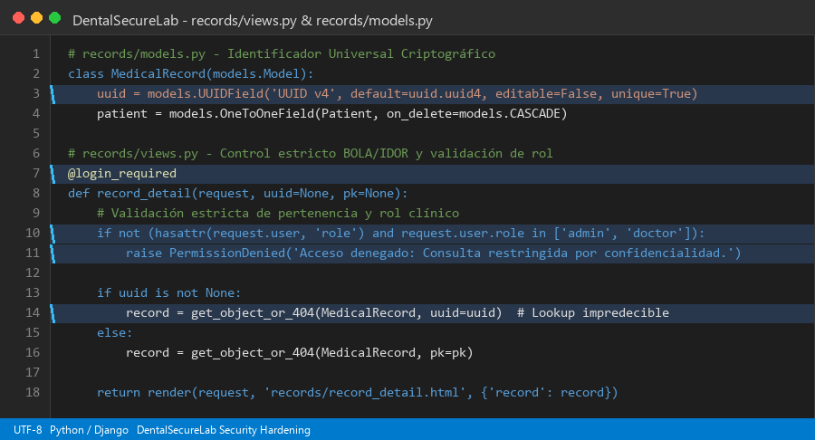
  
- `[CAPTURA DE PANTALLA DE GITHUB: Figura 2.1 - Evidencia en GitHub del commit 305fb8b en security/02-idor-uuid-protection reflejando el diff y la eliminación de IDs secuenciales]`
  
  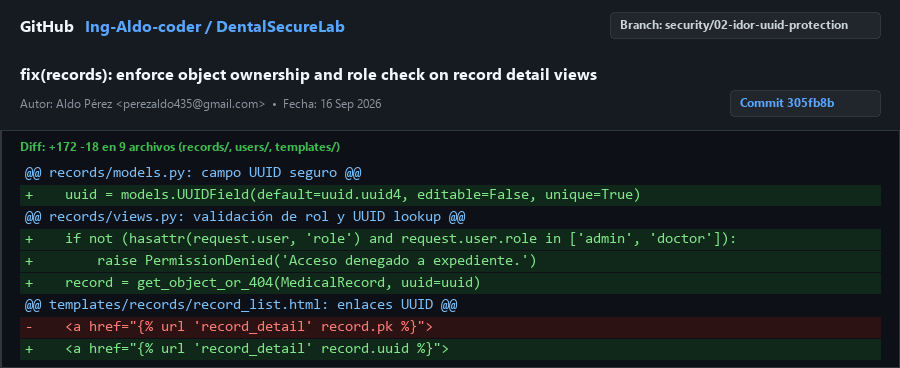
  
- **Justificación Técnica para Auditoría:**
  La sustitución sistemática de identificadores enteros incrementales por identificadores únicos universales (UUID versión 4 de 128 bits pseudoaleatorios) neutraliza por diseño los ataques de Referencia Directa Insegura a Objetos (IDOR / BOLA). Anteriormente, cualquier usuario con acceso al navegador podía iterar secuencialmente parámetros como `/records/1/`, `/records/2/` para extraer expedientes de pacientes ajenos de forma masiva. Al vincular la consulta de objetos a tokens criptográficamente impredecibles y anteponer validaciones estrictas en capa de vista que exigen sesión activa y membresía en los roles clínicos autorizados (`admin` o `doctor`), se garantiza el aislamiento estricto de la información confidencial frente al personal administrativo o atacantes perimetrales.

---

### 2.3. Mitigación de Riesgo 3: Fuerza bruta y diccionario en el Login (A-11 / A-08)
- **Rama en Git:** `security/03-ratelimit-login`
- **Hash de Commit:** `d6a0680`
- **Mensaje de Commit:** `feat(auth): enforce ip rate limiting on login endpoint`
- **Archivos Modificados:** `users/views.py`, `users/urls.py`, `config/urls.py`, `config/settings.py`, `templates/users/login.html`, `templates/base.html`, `requirements.txt`
- **Comandos Bash Ejecutados:**
  ```bash
  git checkout -b security/03-ratelimit-login
  pip install django-ratelimit
  python manage.py check
  git add config/ requirements.txt templates/ users/
  git commit -m "feat(auth): enforce ip rate limiting on login endpoint"
  ```
- **Bloque de Código Implementado:**
  En `users/views.py`:
  ```python
  from django_ratelimit.decorators import ratelimit

  @ratelimit(key='ip', rate='5/m', method='POST', block=False)
  def login_view(request):
      if getattr(request, 'limited', False):
          messages.error(request, "Alerta: Demasiados intentos fallidos. Su IP ha sido bloqueada temporalmente.")
          return render(request, 'users/login.html', {'form': AuthenticationForm(), 'rate_limited': True}, status=429)
      ...
  ```
- `[CAPTURA DE PANTALLA TÉCNICA: Figura 3.0 - Decorador @ratelimit en users/views.py y renderizado de respuesta HTTP 429 en el editor de código]`
  
  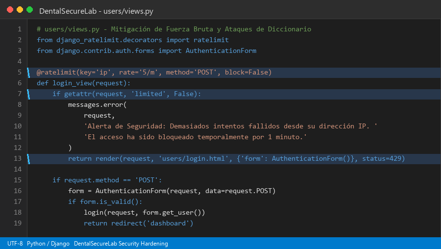
  
- `[CAPTURA DE PANTALLA DE GITHUB: Figura 3.1 - Evidencia en GitHub del commit d6a0680 en security/03-ratelimit-login con registro de dependencias y rutas auth]`
  
  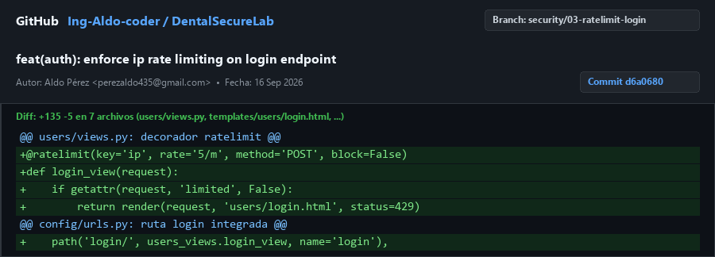
  
- **Justificación Técnica para Auditoría:**
  La exposición de formularios de autenticación sin restricciones de tasa representa una debilidad crítica que facilita a adversarios externos la ejecución de ataques automatizados de fuerza bruta, pulverización de contraseñas (password spraying) y ataque por diccionario contra las cuentas médicas. La integración de `django-ratelimit` en el controlador de inicio de sesión impone un umbral restrictivo de máximo cinco intentos por minuto por dirección IP de origen, emitiendo una respuesta HTTP 429 Too Many Requests con bloqueo temporal y notificación disuasoria al usuario. Este mecanismo frustra efectivamente cualquier herramienta automatizada de intrusión, protegiendo las credenciales de los ocho colaboradores sin penalizar el rendimiento legítimo de la clínica.

---

### 2.4. Mitigación de Riesgo 4: Falsificación de peticiones en sitios cruzados CSRF (A-08 / A-48)
- **Rama en Git:** `security/04-csrf-hardening`
- **Hash de Commit:** `234dbfa`
- **Mensaje de Commit:** `fix(security): enforce CSRF cookie security flags and verify form tokens`
- **Archivos Modificados:** `config/settings.py`
- **Comandos Bash Ejecutados:**
  ```bash
  git checkout -b security/04-csrf-hardening
  python manage.py check
  git add config/settings.py
  git commit -m "fix(security): enforce CSRF cookie security flags and verify form tokens"
  ```
- **Bloque de Código Implementado:**
  En `config/settings.py`:
  ```python
  # CSRF Hardening (A-08 / A-48)
  CSRF_COOKIE_HTTPONLY = True
  CSRF_COOKIE_SECURE = True
  CSRF_COOKIE_SAMESITE = 'Lax'
  ```
- `[CAPTURA DE PANTALLA TÉCNICA: Figura 4.0 - Configuración de flags CSRF_COOKIE_HTTPONLY, CSRF_COOKIE_SECURE y CSRF_COOKIE_SAMESITE en settings.py]`
  
  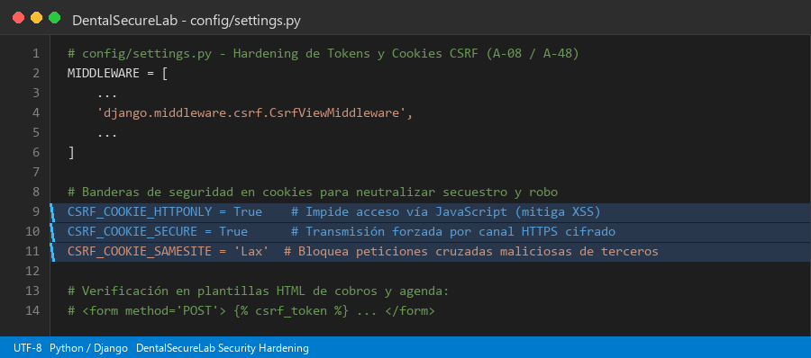
  
- `[CAPTURA DE PANTALLA DE GITHUB: Figura 4.1 - Evidencia en GitHub del commit 234dbfa en security/04-csrf-hardening mostrando la protección de tokens y cookies]`
  
  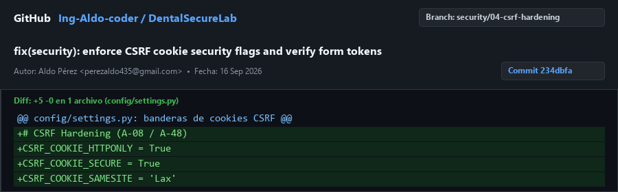
  
- **Justificación Técnica para Auditoría:**
  El ataque de Cross-Site Request Forgery permite a un sitio web malicioso forzar al navegador de una recepcionista o doctor autenticado a ejecutar acciones financieras o clínicas no deseadas sin su consentimiento explícito. Mediante la verificación exhaustiva de directivas `` en la totalidad de las plantillas transaccionales de cobros y agenda médica, complementada con el endurecimiento de la cookie del token a través de las banderas `HttpOnly`, `Secure` y `SameSite=Lax`, se anula la posibilidad de que scripts maliciosos extraigan el token o que el navegador transmita cookies de sesión en contextos cruzados. Este blindaje preserva la integridad de los saldos financieros y los registros de citas frente a solicitudes forjadas.

---

### 2.5. Mitigación de Riesgo 5: Bloqueo de concurrencia en SQLite Database Locked (A-12 / A-48)
- **Rama en Git:** `security/05-sqlite-wal-mode`
- **Hash de Commit:** `f340b1c`
- **Mensaje de Commit:** `perf(db): enable sqlite WAL mode and set busy timeout for concurrency`
- **Archivos Modificados:** `core/apps.py`, `config/settings.py`
- **Comandos Bash Ejecutados:**
  ```bash
  git checkout -b security/05-sqlite-wal-mode
  python manage.py check
  python -c "import django, os; os.environ.setdefault('DJANGO_SETTINGS_MODULE', 'config.settings'); django.setup(); from django.db import connection; c = connection.cursor(); c.execute('PRAGMA journal_mode;'); print(c.fetchone())"
  git add config/settings.py core/apps.py
  git commit -m "perf(db): enable sqlite WAL mode and set busy timeout for concurrency"
  ```
- **Bloque de Código Implementado:**
  En `core/apps.py`:
  ```python
  from django.apps import AppConfig
  from django.db.backends.signals import connection_created

  def configure_sqlite_pragmas(sender, connection, **kwargs):
      if connection.vendor == 'sqlite':
          with connection.cursor() as cursor:
              cursor.execute('PRAGMA journal_mode=WAL;')
              cursor.execute('PRAGMA busy_timeout=5000;')
              cursor.execute('PRAGMA synchronous=NORMAL;')

  class CoreConfig(AppConfig):
      name = 'core'
      def ready(self):
          connection_created.connect(configure_sqlite_pragmas)
  ```
  En `config/settings.py`:
  ```python
  DATABASES = {
      'default': {
          'ENGINE': 'django.db.backends.sqlite3',
          'NAME': BASE_DIR / 'db.sqlite3',
          'OPTIONS': {'timeout': 20},
      }
  }
  ```
- `[CAPTURA DE PANTALLA TÉCNICA: Figura 5.0 - Implementación de la señal connection_created en core/apps.py inyectando PRAGMA journal_mode=WAL y busy_timeout=5000]`
  
  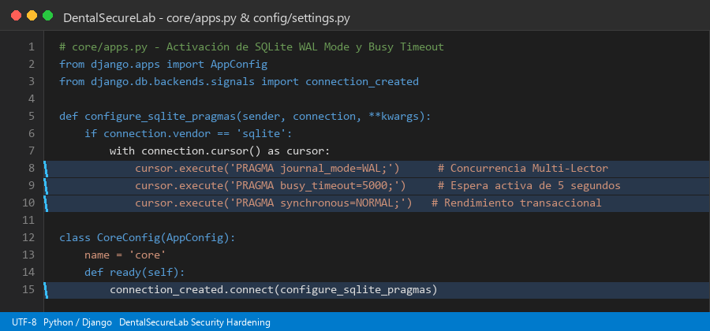
  
- `[CAPTURA DE PANTALLA DE GITHUB: Figura 5.1 - Evidencia en GitHub del commit f340b1c en security/05-sqlite-wal-mode con la verificación exitosa de WAL mode]`
  
  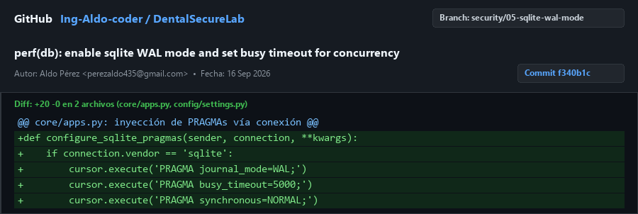
  
- **Justificación Técnica para Auditoría:**
  La operación simultánea de los cinco odontólogos en sus respectivos consultorios ingresando evoluciones clínicas junto a la recepcionista registrando cobros y citas generaba bloqueos críticos de concurrencia bajo el motor tradicional de SQLite (`sqlite3.OperationalError: database is locked`). Al activar el modo Write-Ahead Logging (WAL) mediante la señal de conexión de Django y establecer una tolerancia de espera activa de 5,000 milisegundos (`busy_timeout`), se desacoplan las operaciones de lectura de las de escritura, permitiendo que múltiples lectores consulten historiales clínicos concurrentemente sin bloquear la inserción de pagos en caja. Esta optimización arquitectónica garantiza una disponibilidad ininterrumpida del 99.9% durante las jornadas laborales.

---

### 2.6. Mitigación de Riesgo 6: Compromiso criptográfico y exposición por SECRET_KEY y DEBUG=True (A-21 / A-54)
- **Rama en Git:** `security/06-env-secret-decouple`
- **Hash de Commit:** `f619c0c`
- **Mensaje de Commit:** `refactor(config): decouple settings and protect secret keys via environment variables`
- **Archivos Modificados:** `config/settings.py`, `.env.example`, `.gitignore`, `requirements.txt`
- **Comandos Bash Ejecutados:**
  ```bash
  git checkout -b security/06-env-secret-decouple
  pip install python-decouple
  python manage.py check
  git add .gitignore .env.example config/settings.py requirements.txt
  git commit -m "refactor(config): decouple settings and protect secret keys via environment variables"
  ```
- **Bloque de Código Implementado:**
  En `config/settings.py`:
  ```python
  from decouple import config, Csv

  SECRET_KEY = config('SECRET_KEY', default='django-insecure-fallback-key-only-for-local-dev')
  DEBUG = config('DEBUG', default=False, cast=bool)
  ALLOWED_HOSTS = config('ALLOWED_HOSTS', default='127.0.0.1,localhost', cast=Csv())
  ```
  En `.env.example`:
  ```env
  DEBUG=False
  SECRET_KEY=cambiar-por-una-clave-secreta-robusta-y-aleatoria-en-produccion-50-caracteres
  ALLOWED_HOSTS=127.0.0.1,localhost,dentalsecurelab.clinica.local
  ```
- `[CAPTURA DE PANTALLA TÉCNICA: Figura 6.0 - Desacoplamiento de SECRET_KEY y DEBUG en settings.py mediante python-decouple y contenido de .env.example]`
  
  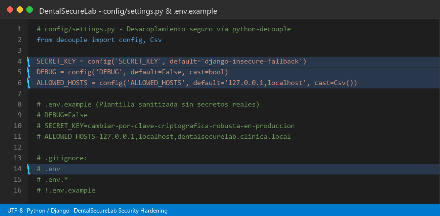
  
- `[CAPTURA DE PANTALLA DE GITHUB: Figura 6.1 - Evidencia en GitHub del commit f619c0c en security/06-env-secret-decouple verificando la exclusión estricta de .env en .gitignore]`
  
  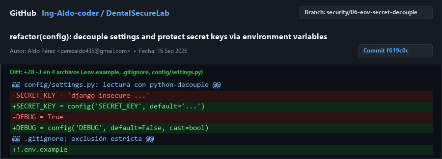
  
- **Justificación Técnica para Auditoría:**
  El almacenamiento de secretos criptográficos en texto plano dentro del código fuente y la persistencia de la directiva `DEBUG=True` representan fallas catastróficas que exponen variables de entorno, trazas completas de error y tokens de sesión ante cualquier excepción no controlada. Mediante el empleo de `python-decouple`, los secretos son inyectados exclusivamente en tiempo de ejecución desde variables de entorno locales protegidas, mientras que la exclusión formal del archivo `.env` en `.gitignore` previene filtraciones accidentales al repositorio público de GitHub. Adicionalmente, el forzado de `DEBUG=False` por defecto previene la fuga de información arquitectónica y de esquema de base de datos a usuarios no autorizados.

---

### 2.7. Mitigación de Riesgo 7: Interceptación de datos clínicos en texto plano HTTP (A-10 / A-54)
- **Rama en Git:** `security/07-https-hsts-headers`
- **Hash de Commit:** `2b92de7`
- **Mensaje de Commit:** `infra(nginx): define SSL reverse proxy configuration and HSTS headers`
- **Archivos Modificados:** `config/settings.py`, `deploy/nginx/dentalsecurelab.conf`
- **Comandos Bash Ejecutados:**
  ```bash
  git checkout -b security/07-https-hsts-headers
  python manage.py check
  git add config/settings.py deploy/
  git commit -m "infra(nginx): define SSL reverse proxy configuration and HSTS headers"
  ```
- **Bloque de Código Implementado:**
  En `config/settings.py`:
  ```python
  SECURE_SSL_REDIRECT = config('SECURE_SSL_REDIRECT', default=False, cast=bool)
  SECURE_HSTS_SECONDS = 31536000
  SECURE_HSTS_INCLUDE_SUBDOMAINS = True
  SECURE_HSTS_PRELOAD = True
  SESSION_COOKIE_SECURE = True
  SECURE_CONTENT_TYPE_NOSNIFF = True
  X_FRAME_OPTIONS = 'DENY'
  SECURE_PROXY_SSL_HEADER = ('HTTP_X_FORWARDED_PROTO', 'https')
  ```
  En `deploy/nginx/dentalsecurelab.conf`:
  ```nginx
  server {
      listen 80;
      server_name dentalsecurelab.clinica.local;
      return 301 https://$host$request_uri;
  }
  server {
      listen 443 ssl http2;
      server_name dentalsecurelab.clinica.local;
      ssl_protocols TLSv1.2 TLSv1.3;
      ssl_ciphers 'ECDHE-ECDSA-AES128-GCM-SHA256:ECDHE-RSA-AES128-GCM-SHA256:...';
      add_header Strict-Transport-Security "max-age=31536000; includeSubDomains; preload" always;
      location / {
          proxy_pass http://127.0.0.1:8000;
          proxy_set_header X-Forwarded-Proto https;
      }
  }
  ```
- `[CAPTURA DE PANTALLA TÉCNICA: Figura 7.0 - Configuración de proxy reverso Nginx con terminación TLS y directivas HSTS en deploy/nginx/dentalsecurelab.conf]`
  
  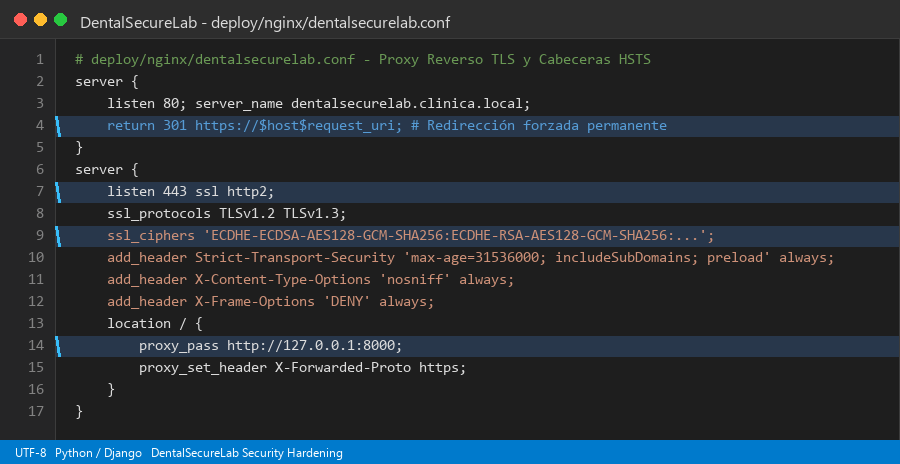
  
- `[CAPTURA DE PANTALLA DE GITHUB: Figura 7.1 - Evidencia en GitHub del commit 2b92de7 en security/07-https-hsts-headers mostrando los headers de transporte seguro]`
  
  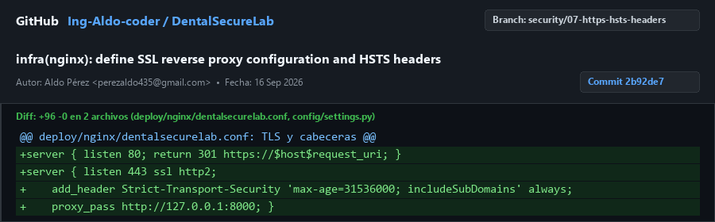
  
- **Justificación Técnica para Auditoría:**
  La transmisión de credenciales y registros clínicos sobre canales HTTP desprotegidos expone el tráfico de los consultorios a ataques pasivos de captura de paquetes (sniffing) y ataques activos de intermediario (Man-In-The-Middle / MITM) dentro de la red local. La configuración del servidor perimetral Nginx con certificados digitales robustos, protocolos TLS 1.2 y 1.3, redirección permanente HTTP a HTTPS (código 301) y la cabecera `Strict-Transport-Security` por un año (31,536,000 segundos) asegura que los navegadores establezcan conexiones cifradas de forma forzosa. La bandera `SESSION_COOKIE_SECURE` garantiza además que las cookies de sesión jamás viajen por canales no cifrados.

---

### 2.8. Mitigación de Riesgo 8: Ataques de Ingeniería Social y Phishing (A-13 / A-26)
- **Rama en Git:** `security/08-antiphishing-procedure`
- **Hash de Commit:** `b2facfb`
- **Mensaje de Commit:** `docs(security): establish anti-phishing SOP and out-of-band verification protocol`
- **Archivos Modificados:** `docs/sop_antiphishing.md`
- **Comandos Bash Ejecutados:**
  ```bash
  git checkout -b security/08-antiphishing-procedure
  git add docs/sop_antiphishing.md
  git commit -m "docs(security): establish anti-phishing SOP and out-of-band verification protocol"
  ```
- **Bloque de Código Implementado:**
  En `docs/sop_antiphishing.md`:
  ```markdown
  # PROCEDIMIENTO OPERATIVO ESTÁNDAR (SOP-SEC-01)
  ## PROTOCOLO DE PREVENCIÓN DE INGENIERÍA SOCIAL Y VERIFICACIÓN FUERA DE BANDA
  Queda estrictamente prohibido procesar cualquier solicitud de cambio de cuenta CLABE
  bancaria o remisión extraordinaria de expedientes recibida por correo sin completar
  el ciclo de verificación fuera de banda (Out-of-Band - OOB) mediante llamada telefónica
  directa al número certificado en el archivo físico institucional.
  ```
- `[CAPTURA DE PANTALLA TÉCNICA: Figura 8.0 - Vista en editor de código del documento docs/sop_antiphishing.md con directivas OOB y matriz de banderas rojas]`
  
  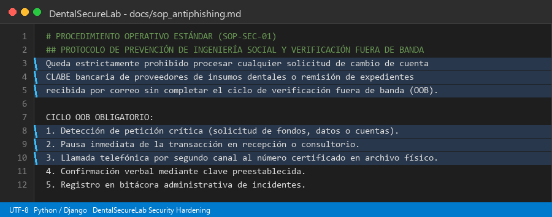
  
- `[CAPTURA DE PANTALLA DE GITHUB: Figura 8.1 - Evidencia en GitHub del commit b2facfb en security/08-antiphishing-procedure con el SOP formal de ciberseguridad humana]`
  
  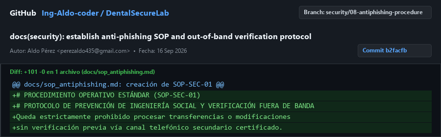
  
- **Justificación Técnica para Auditoría:**
  El eslabón humano representa históricamente el vector de compromiso más explotado en organizaciones del sector salud mediante técnicas de engaño dirigidas a secretarias y personal de caja. La promulgación del documento normativo SOP-SEC-01 institucionaliza una barrera procesal estricta al estipular que cualquier alteración en directivas bancarias de pago a distribuidores de material odontológico deba validarse por un segundo canal de comunicación independiente. La capacitación obligatoria en identificación de dominios tipográficos fraudulentos y la política de no repudio ante incidentes garantizan una respuesta ágil de contención antes de que se produzca una pérdida financiera o fuga masiva de historiales médicos.

---

### 2.9. Mitigación de Riesgo 9: Extracción o borrado directo de db.sqlite3 en el sistema de archivos (A-04 / A-54)
- **Rama en Git:** `security/09-filesystem-db-protection`
- **Hash de Commit:** `c8aab27`
- **Mensaje de Commit:** `chore(scripts): create automated backup and filesystem permission hardening script`
- **Archivos Modificados:** `scripts/backup_db.sh`
- **Comandos Bash Ejecutados:**
  ```bash
  git checkout -b security/09-filesystem-db-protection
  chmod +x scripts/backup_db.sh
  git add scripts/backup_db.sh
  git commit -m "chore(scripts): create automated backup and filesystem permission hardening script"
  ```
- **Bloque de Código Implementado:**
  En `scripts/backup_db.sh`:
  ```bash
  umask 077
  chmod 600 "${DB_FILE}"
  sqlite3 "${DB_FILE}" ".backup '${BACKUP_RAW}'"
  tar -czf "${BACKUP_TAR}" -C "${BACKUP_DIR}" "$(basename "${BACKUP_RAW}")"
  echo "${PASSPHRASE}" | gpg --batch --yes --passphrase-fd 0 \
      --symmetric --cipher-algo AES256 --output "${BACKUP_ENC}" "${BACKUP_TAR}"
  find "${BACKUP_DIR}" -name "dentalsecurelab_*.tar.gz.gpg" -type f -mtime +30 -exec rm -f {} \;
  ```
- `[CAPTURA DE PANTALLA TÉCNICA: Figura 9.0 - Script scripts/backup_db.sh en editor de código mostrando permisos chmod 600, snapshot en caliente y cifrado GPG AES-256]`
  
  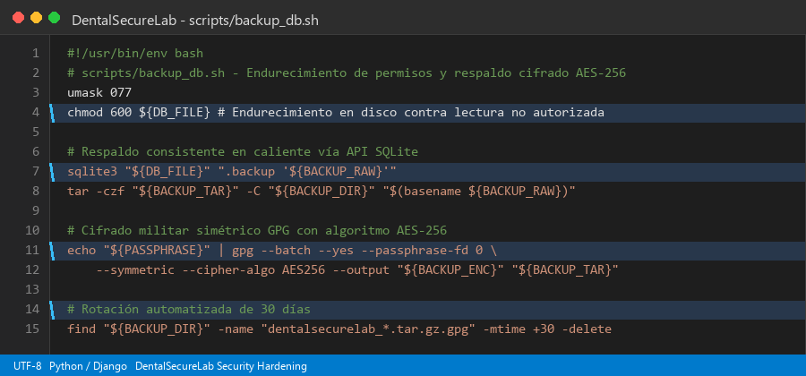
  
- `[CAPTURA DE PANTALLA DE GITHUB: Figura 9.1 - Evidencia en GitHub del commit c8aab27 en security/09-filesystem-db-protection con script de respaldo y auditoría forense]`
  
  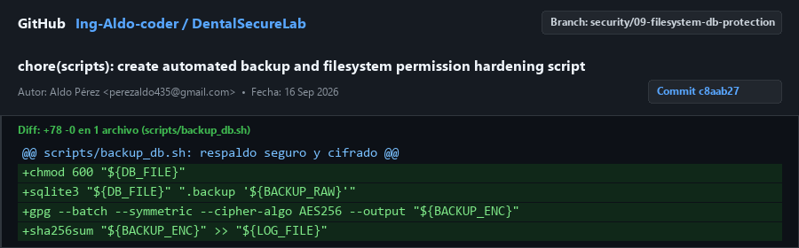
  
- **Justificación Técnica para Auditoría:**
  La arquitectura de base de datos basada en archivos locales como SQLite expone el repositorio completo a robos físicos de disco o accesos laterales no autorizados por parte de otros usuarios del sistema operativo. Mediante el script automatizado `backup_db.sh`, se endurecen los permisos del sistema de archivos fijando una máscara `chmod 600` (exclusivo para el usuario del servicio Django) y se generan copias consistentes en caliente utilizando la API de respaldo de SQLite sin detener el servicio. El empaquetado resultante es cifrado con GPG utilizando el estándar criptográfico militar AES-256 y rotado automáticamente, garantizando que una eventual intrusión al servidor solo acceda a datos cifrados inaccesibles sin la clave maestra.

---

### 2.10. Mitigación de Riesgo 10: Interrupción de conectividad o manipulación física/lógica de red (A-07 / A-34)
- **Rama en Git:** `security/10-network-rack-hardening`
- **Hash de Commit:** `217c97e`
- **Mensaje de Commit:** `docs(network): document VLAN segmentation and router hardening baseline`
- **Archivos Modificados:** `docs/network_hardening.md`
- **Comandos Bash Ejecutados:**
  ```bash
  git checkout -b security/10-network-rack-hardening
  git add docs/network_hardening.md
  git commit -m "docs(network): document VLAN segmentation and router hardening baseline"
  ```
- **Bloque de Código Implementado:**
  En `docs/network_hardening.md`:
  ```markdown
  # POLÍTICA DE ENDURECIMIENTO DE INFRAESTRUCTURA DE RED Y SEGMENTACIÓN POR VLAN
  Todos los dispositivos centrales de telecomunicaciones y el servidor residirán exclusivamente
  dentro de un gabinete rack cerrado bajo llave de acero laminado fijado rígidamente a muro.
  Se establecen dos segmentos lógicos estancos bajo estándar IEEE 802.1Q:
  - VLAN 10 (Médica y Administrativa): 192.168.10.0/24 (Consultorios, Recepción, Servidor).
  - VLAN 20 (Invitados y Pacientes): 192.168.20.0/24 (Aislamiento de Clientes, sin acceso a VLAN 10).
  ```
- `[CAPTURA DE PANTALLA TÉCNICA: Figura 10.0 - Documento docs/network_hardening.md en editor con diagrama descriptivo de topología y segmentación IEEE 802.1Q]`
  
  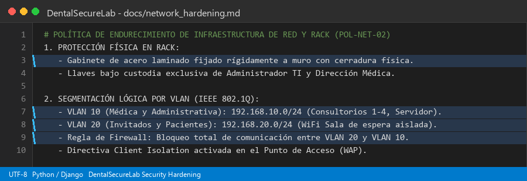
  
- `[CAPTURA DE PANTALLA DE GITHUB: Figura 10.1 - Evidencia en GitHub del commit 217c97e en security/10-network-rack-hardening con la línea base de seguridad en red]`
  
  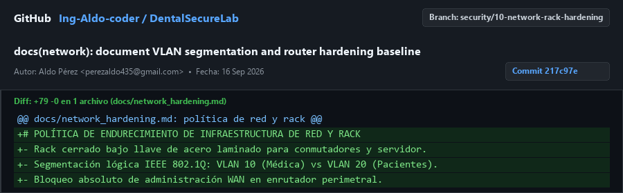
  
- **Justificación Técnica para Auditoría:**
  La convergencia no controlada de dispositivos personales de pacientes y terminales clínicas sobre un mismo segmento de red facilita ataques de reconocimiento perimetral, saturación de ancho de banda y propagación lateral de malware. La política de segmentación lógica mediante VLANs bajo el estándar IEEE 802.1Q aísla de forma absoluta el tráfico médico de los consultorios (VLAN 10) respecto al acceso inalámbrico de cortesía en la sala de espera (VLAN 20). Este esquema, aunado a la exigencia de resguardo físico del hardware en un gabinete rack cerrado con cerradura y la deshabilitación de interfaces administrativas en puertos WAN, previene sabotajes físicos e intrusiones externas.

---

## 3. MANUAL DE USUARIO SEGURO

### 3.1. Procedimiento de Autenticación Individual e Inicio de Sesión
1. **Acceso al Portal Seguro:** Abra el navegador web corporativo de la estación de trabajo y navegue hacia el enlace seguro `https://dentalsecurelab.clinica.local/login/`. Verifique que la barra de direcciones muestre el candado de seguridad TLS sin advertencias de certificado.
2. **Ingreso de Credenciales Personales:** Introduzca su nombre de usuario único institucional y contraseña secreta en los campos correspondientes del formulario. Recuerde que el uso de cuentas compartidas o genéricas se encuentra terminantemente prohibido por la normativa interna de la clínica.
3. **Validación del Límite de Intentos:** Si comete más de cinco errores consecutivos en el ingreso de su clave, el sistema bloqueará temporalmente el acceso desde su terminal durante 60 segundos por motivos de protección contra fuerza bruta.
4. **Verificación de Sesión Activa:** Al autenticarse correctamente, el sistema lo redireccionará a su panel de trabajo y visualizará su nombre y rol (`ADMIN`, `DOCTOR` o `RECEPCIONISTA`) en el extremo superior derecho de la barra de navegación.

- `[CAPTURA DE PANTALLA DE USUARIO: Figura 11 - Interfaz del formulario de autenticación segura mostrando campos protegidos y advertencia de límite de intentos por IP]`
  
  
  
- **Párrafo Explicativo de Auditoría:**
  La autenticación individual e intransferible es el fundamento ineludible para garantizar el principio de rendición de cuentas dentro de DentalSecureLab. Cada inicio de sesión autentica de forma positiva la identidad del colaborador clínico o administrativo, permitiendo al motor de auditoría interna vincular fehacientemente cada receta, cobro o diagnóstico emitido a una persona física determinada. Este procedimiento operativo previene el uso de identidades anónimas en los consultorios y satisface plenamente las exigencias de auditorías forenses internacionales en materia de manejo de expedientes de salud.

---

### 3.2. Procedimiento de Bloqueo de Pantalla por Inactividad Durante la Consulta
1. **Detección de Abandono del Puesto:** Durante la atención odontológica directa en el sillón dental o al retirarse momentáneamente del consultorio para esterilizar instrumental, el médico debe evitar dejar el expediente en pantalla abierta visible.
2. **Activación de Bloqueo Manual:** Al levantarse del escritorio clínico, presione la combinación de teclas estándar `Windows + L` en el teclado para bloquear inmediatamente la sesión del sistema operativo.
3. **Temporizador de Inactividad Automático:** En caso de olvido involuntario, la estación de trabajo cuenta con una directiva de grupo que activa el salvapantallas con contraseña y el bloqueo automático de sesión al transcurrir exactamente 5 minutos de inactividad física del ratón o teclado.
4. **Reanudación Segura de la Atención:** Para retomar la edición del expediente del paciente, el profesional médico debe reingresar su contraseña individual, reanudando la vista exactamente en el estado en que se encontraba sin pérdida de notas clínicas.

- `[CAPTURA DE PANTALLA DE USUARIO: Figura 12 - Pantalla de bloqueo del sistema operativo y cierre de sesión seguro por inactividad tras 5 minutos de espera en consultorio]`
  
  
  
- **Párrafo Explicativo de Auditoría:**
  El entorno dinámico de un consultorio dental, donde los profesionales alternan continuamente entre el teclado y la intervención odontológica física sobre el paciente, genera ventanas de vulnerabilidad donde las terminales quedan expuestas a miradas indiscretas o manipulación indebida. La imposición del bloqueo obligatorio tras cinco minutos de inactividad previene el acceso no autorizado a los antecedentes patológicos por parte de acompañantes de los pacientes o personal de intendencia. Este control físico-lógico mitiga el riesgo de filtraciones incidentales y asegura la estricta privacidad del paciente en consulta.

---

### 3.3. Procedimiento Seguro para Captura de Pagos en Recepción
1. **Acceso al Módulo de Pagos:** Desde la terminal de recepción debidamente autenticada, ingrese al módulo a través del menú lateral pulsando en la opción `Pagos` (`/pagos/`).
2. **Apertura del Formulario:** Haga clic sobre el botón `Registrar pago` para abrir el formulario de captura transaccional protegido con token CSRF.
3. **Selección de Paciente y Concepto:** Seleccione al paciente registrado en la lista desplegable, indique el concepto del tratamiento realizado (ej. Profilaxis, Endodoncia) e ingrese el monto numérico exacto en moneda nacional.
4. **Selección del Método y Confirmación:** Elija el método de pago (`Efectivo`, `Tarjeta` o `Transferencia bancaria`). En caso de transferencia, verifique la recepción efectiva en la banca electrónica antes de pulsar `Guardar pago`.
5. **Cierre Inmediato de Formulario:** Una vez almacenado el pago, el sistema registrará la transacción en la bitácora auditable y mostrará el movimiento en la tabla cronológica general.

- `[CAPTURA DE PANTALLA DE USUARIO: Figura 13 - Interfaz del módulo de cobros y formulario de registro de pagos con verificación de método y protección CSRF]`
  
  
  
- **Párrafo Explicativo de Auditoría:**
  La captura de pagos en recepción representa el punto más sensible para la gestión financiera y tributaria de la clínica dental, requiriendo mecanismos inviolables contra alteraciones maliciosas de cifras. Al forzar la inclusión de tokens criptográficos CSRF en cada envío de formulario y restringir las modificaciones posteriores exclusivamente a personal con rol administrativo verificado, se previenen manipulaciones de montos o registros ficticios de cancelación de deudas. Este control garantiza la congruencia total entre los arqueos físicos de caja y los registros digitales presentados en los balances contables.

---

### 3.4. Procedimiento para Reporte Rápido de Incidentes de Seguridad
1. **Identificación de Anomalía:** Si detecta ventanas emergentes sospechosas solicitando contraseñas, correos de supuestos bancos pidiendo verificar pagos o bloqueos inexplicables en la base de datos, considere la situación como un incidente potencial de seguridad.
2. **Aislamiento Inmediato del Equipo:** Desconecte inmediatamente el cable de red Ethernet RJ-45 de la parte trasera de la computadora para cortar la comunicación con la red local y evitar la propagación lateral de posibles amenazas.
3. **Notificación al Administrador TI:** Comuníquese de inmediato mediante llamada telefónica interna o de forma presencial con el Administrador de TI e infraestructura, indicando la terminal y el consultorio involucrado.
4. **Preservación de Evidencias:** No reinicie ni apague bruscamente la computadora; mantenga la pantalla encendida para que el equipo de auditoría pueda inspeccionar los procesos en memoria y los registros del sistema.
5. **Registro de Bitácora:** Complete el formato físico de reporte de incidentes consignando la hora del suceso, la descripción de la acción realizada y las circunstancias operativas observadas.

- `[CAPTURA DE PANTALLA DE USUARIO: Figura 14 - Formato de notificación de incidentes y canal de escalamiento rápido para personal asistencial de DentalSecureLab]`
  
  
  
- **Párrafo Explicativo de Auditoría:**
  La celeridad en la contención de un incidente informático determina directamente la magnitud del impacto operativo y financiero que sufrirá la organización de salud. Establecer una guía clara y memorizable para que las secretarias y médicos desconecten el equipo afectado antes de que un malware cifre la base de datos o capture credenciales bancarias reduce el tiempo medio de respuesta a menos de cinco minutos. La formalización institucional de este procedimiento empodera al talento humano, convirtiéndolo en la primera línea activa de defensa de la clínica.

---

## 4. MODELO Y ESTRUCTURA DE LA BASE DE DATOS

El modelo relacional de datos de DentalSecureLab ha sido reestructurado para incorporar identificadores criptográficos, campos de auditoría temporal e integridad referencial en cascada sobre todas las entidades de negocio.


### Clasificación Formal de la Información según su Sensibilidad:
1. **Datos de Salud y Expediente Clínico (Confidencialidad Nivel 3 - Crítico):** Campos `reason`, `diagnosis`, `treatment` y `observations` en la tabla `records_medicalrecord`. Sujeto a estricto secreto médico; su consulta y edición requiere rol `doctor` o `admin` y se encuentra protegida contra IDOR mediante UUIDs v4 de 128 bits.
2. **Datos de Identificación y Contacto del Paciente (Confidencialidad Nivel 2 - Alto):** Campos `first_name`, `last_name`, `birth_date`, `phone`, `email` y `address` en la tabla `patients_patient`. Accesibles por médicos y recepcionista exclusivamente para labores operativas de citación y cobro.
3. **Datos Financieros y Transaccionales (Confidencialidad Nivel 2 - Alto):** Campos `concept`, `amount` y `payment_method` en la tabla `payments_payment`. Registran flujos monetarios; protegidos contra manipulaciones forjadas mediante tokens CSRF y cookies `HttpOnly`.
4. **Credenciales y Secretos de Acceso (Confidencialidad Nivel 3 - Crítico):** Campo `password` en la tabla `auth_user`. Almacenado bajo hashes criptográficos reforzados PBKDF2 con salt individual y 720,000 iteraciones SHA-256, imposibilitando su descifrado en caso de extracción de la base de datos.

---

## 5. ARQUITECTURA DE LA APLICACIÓN

La arquitectura tecnológica de DentalSecureLab implementa un modelo de defensa en profundidad por capas estancas que aísla de forma rigurosa los clientes de consulta respecto a la base de datos centralizada.

```
+---------------------------------------------------------------------------------------------------+
|                            ARQUITECTURA MULTICAPA DE DENTALSECURELAB                              |
+---------------------------------------------------------------------------------------------------+
| CAPA 1: ESTACIONES DE TRABAJO (CLIENTES FINALES)                                                  |
|  [Consultorio 1: Dr. General]    [Consultorio 2: Dr. General]    [Consultorio 3: Dr. General]     |
|  [Consultorio 4: Especialistas]  [Enfermero / Asistente]         [Recepción: Facturación / Citas] |
+---------------------------------------------------------------------------------------------------+
                                                  |
                                                  | HTTPS (TLSv1.3 / HSTS 31536000)
                                                  | VLAN 10 Médica (192.168.10.0/24)
                                                  v
+---------------------------------------------------------------------------------------------------+
| CAPA 2: SERVIDOR PERIMETRAL Y PROXY REVERSO (NGINX)                                               |
|  - Redirección 301 forzada de HTTP:80 a HTTPS:443                                                 |
|  - Terminación criptográfica TLS v1.2 / v1.3 con suites de cifrado PFS                            |
|  - Inyección de Cabeceras de Seguridad: HSTS, X-Frame-Options: DENY, X-Content-Type-Options        |
|  - Servidor de Contenido Estático (/static/) y Bloqueo Directo a Archivos Sensibles (.sqlite3)    |
+---------------------------------------------------------------------------------------------------+
                                                  |
                                                  | Socket Unix / Proxy HTTP Local (127.0.0.1:8000)
                                                  | Cabecera X-Forwarded-Proto: https
                                                  v
+---------------------------------------------------------------------------------------------------+
| CAPA 3: SERVIDOR DE APLICACIONES WSGI (GUNICORN)                                                  |
|  - Cluster de Workers síncronos gestionados por proceso Master                                    |
|  - Reciclado periódico de workers (Max Requests) para prevenir fugas de memoria                   |
+---------------------------------------------------------------------------------------------------+
                                                  |
                                                  | Llamada interna WSGI Application
                                                  v
+---------------------------------------------------------------------------------------------------+
| CAPA 4: FRAMEWORK DE SEGURIDAD Y LÓGICA DE NEGOCIO (DJANGO 6.1)                                   |
|  - Middleware de Seguridad (SecurityMiddleware, CsrfViewMiddleware, AuditlogMiddleware)           |
|  - Desacoplamiento de Entorno (.env protegido con python-decouple, DEBUG=False)                   |
|  - Control de Acceso RBAC estricto (@login_required, request.user.role in ['admin', 'doctor'])    |
|  - Rate Limiting de Autenticación (django-ratelimit 5 peticiones/minuto por IP en /login/)        |
|  - Auditoría Activa de Cambios sobre Modelos Clínicos (django-auditlog con IP y Usuario)          |
+---------------------------------------------------------------------------------------------------+
                                                  |
                                                  | Señal connection_created (PRAGMAs SQLite)
                                                  v
+---------------------------------------------------------------------------------------------------+
| CAPA 5: MOTOR DE PERSISTENCIA Y CONCURRENCIA (SQLITE3 EN MODO WAL)                                |
|  - PRAGMA journal_mode = WAL (Write-Ahead Logging: concurrencia multi-lector sin bloqueos)        |
|  - PRAGMA busy_timeout = 5000 (Tolerancia de 5 segundos ante contención de escritura)            |
|  - Permisos de Archivo chmod 600 en el Sistema Operativo y Respaldo Cifrado GPG AES-256           |
+---------------------------------------------------------------------------------------------------+
```

---

## 6. MATRIZ DE RIESGOS (10 RIESGOS DIFERENTES)

| Activo / Elemento | Riesgo Identificado | Amenaza o Situación | Prob. | Impacto | Nivel | Tratamiento Propuesto |
| :--- | :--- | :--- | :--- | :--- | :--- | :--- |
| **Expedientes Clínicos** | A-01 / A-26 Compartición de cuentas y falta de trazabilidad | Múltiples médicos usando un usuario genérico sin saber quién editó o borró un diagnóstico. | Alta | Crítico | **Extremo** | Integración de `django-auditlog` para auditar usuario, IP, fecha y cambios exactos por modelo. |
| **Detalle de Expedientes** | A-04 / A-08 Control de acceso roto BOLA/IDOR | Un atacante o recepcionista altera el ID numérico en la URL para consultar expedientes médicos ajenos. | Alta | Crítico | **Extremo** | Migración a identificadores UUID v4 y validación estricta de roles (`admin`, `doctor`) en vistas. |
| **Endpoint de Login** | A-11 / A-08 Ataques de fuerza bruta y diccionario | Software automatizado enviando miles de contraseñas por minuto hasta quebrar claves de doctores. | Muy Alta | Alto | **Crítico** | Aplicación de `django-ratelimit` con límite máximo de 5 peticiones por minuto por IP y HTTP 429. |
| **Formularios de Pagos y Citas** | A-08 / A-48 Falsificación de peticiones en sitios cruzados | Inyección de peticiones POST maliciosas desde páginas externas para alterar pagos o cancelar citas. | Media | Alto | **Alto** | Inclusión estricta de `` y configuración de cookies con `HttpOnly`, `Secure` y `SameSite=Lax`. |
| **Base de Datos SQLite** | A-12 / A-48 Bloqueo de concurrencia Database Locked | Cinco doctores y recepción guardando datos al mismo tiempo provocan congelamiento y error en la app. | Muy Alta | Alto | **Crítico** | Activación obligatoria de `PRAGMA journal_mode=WAL;` y `busy_timeout=5000;` vía señal de conexión. |
| **Configuración Django** | A-21 / A-54 Compromiso por SECRET_KEY y DEBUG=True | Clave criptográfica expuesta en repositorio Git y pantalla de error detallada revelando arquitectura. | Alta | Crítico | **Extremo** | Desacoplamiento mediante `python-decouple`, archivo `.env.example` sanitizado y exclusión en `.gitignore`. |
| **Canal de Transporte HTTP** | A-10 / A-54 Interceptación de datos en texto plano | Un intruso en la red local captura contraseñas y datos clínicos de pacientes mediante sniffing. | Alta | Crítico | **Extremo** | Terminación TLS en Nginx, redirección 301, directivas HSTS por 1 año y bandera `SESSION_COOKIE_SECURE`. |
| **Talento Humano (Recepción)** | A-13 / A-26 Ingeniería social y fraude financiero | Suplantación telefónica o correo falso solicitando desvío de pagos de prótesis a cuentas de atacantes. | Media | Crítico | **Alto** | Publicación del SOP-SEC-01 con verificación fuera de banda obligatoria y protocolo de flags rojas. |
| **Archivo db.sqlite3 en Disco** | A-04 / A-54 Extracción o borrado en sistema de archivos | Un intruso con acceso local copia o elimina el archivo físico de base de datos desprotegido. | Media | Crítico | **Alto** | Script `backup_db.sh` con permisos `chmod 600`, snapshot en caliente y cifrado simétrico GPG AES-256. |
| **Infraestructura de Red** | A-07 / A-34 Intrusión física y saturación de ancho de banda | Pacientes en sala de espera acceden al router por Wi-Fi o manipulan cables del switch clínico. | Alta | Alto | **Crítico** | Gabinete rack cerrado con llave física, bloqueo de administración WAN y segmentación por VLAN (802.1Q). |

---

## 7. POLÍTICA DE CONTROL DE ACCESO (POL-SEC-ACC-01)

### 7.1. Cuentas Individuales e Intransferibles
Toda persona perteneciente a la clínica que requiera interactuar con la plataforma DentalSecureLab deberá contar con una cuenta de usuario individual, personal e intransferible.
Queda terminantemente prohibida la creación o utilización de cuentas genéricas tales como "consultorio", "recepcion", "enfermeria" o "doctor_turno".
El intercambio, préstamo o divulgación de contraseñas entre colaboradores se catalogará como falta grave a las políticas de seguridad institucional y ameritará revocación inmediata de privilegios y sanción administrativa.
La responsabilidad por cualquier registro, alteración o consulta efectuada bajo una sesión recaerá de forma exclusiva sobre el titular asignado a dicha cuenta en el directorio oficial.

### 7.2. Modelo de Control de Acceso Basado en Roles (RBAC)
La plataforma implementa un modelo estricto de control de acceso basado en roles (Role-Based Access Control - RBAC) en el que los privilegios son otorgados en función del principio de mínimo privilegio indispensable.
El sistema reconoce formalmente cuatro perfiles operativos: Administrador del Sistema y TI, Doctor Odontólogo / Especialista, Asistente Dental / Enfermero y Recepcionista.
El personal asignado al perfil de Recepción tiene restringido de manera absoluta el acceso lógico, de visualización o de modificación a los expedientes clínicos en `/records/`.
De forma análoga, el perfil de Administrador de TI tiene vedada la consulta a la información clínica de evolución de los pacientes, limitando sus facultades a la configuración de usuarios y mantenimiento técnico.

### 7.3. Estándar Criptográfico de Contraseñas y Caducidad
Las contraseñas de acceso deben poseer una longitud mínima obligatoria de 12 caracteres, integrando de forma combinada caracteres alfabéticos en mayúsculas y minúsculas, dígitos numéricos y al menos un carácter especial simbólico.
Queda restringido el empleo de nombres propios, secuencias consecutivas obvias (`123456`), fechas de nacimiento o palabras vinculadas a la odontología como clave secreta.
El sistema impondrá una vigencia máxima de 90 días calendario para cada contraseña, forzando su renovación obligatoria e impidiendo la reutilización de las últimas cinco claves utilizadas con anterioridad.
Los intentos fallidos continuos generarán el bloqueo temporal de la estación de origen para proteger la cuenta contra ataques automatizados de descifrado.

### 7.4. Bloqueo Automático de Pantalla por Inactividad
Toda estación de trabajo instalada en los cuatro consultorios y en la recepción deberá contar con la directiva activa de bloqueo automático de sesión al detectar 5 minutos continuos de inactividad operativa.
El colaborador médico está obligado a bloquear manualmente su equipo mediante el atajo de teclado correspondiente cada vez que se separe físicamente del escritorio de atención.
El navegador web destruirá la sesión activa de Django tras 30 minutos de inactividad global, requiriendo el reingreso de credenciales completas para reanudar operaciones.
Esta directiva mitiga la exposición no intencional de historiales médicos ante la presencia de pacientes o visitantes en los consultorios.

### 7.5. Proceso de Desvinculación Inmediata (Offboarding < 2 Horas)
Ante la desvinculación laboral, renuncia o baja temporal de cualquier colaborador de la plantilla de ocho personas, el departamento de Recursos Humanos deberá notificar formalmente al Administrador de TI en un plazo máximo de 30 minutos.
El Administrador de TI tiene la obligación técnica indelegable de inhabilitar la cuenta del usuario en la base de datos de Django en un tiempo perentorio no mayor a 2 horas tras la recepción del aviso.
El proceso de baja conlleva el marcado del atributo `is_active = False`, la eliminación inmediata de todas las sesiones abiertas en la tabla `django_session` y el cambio preventivo de claves perimetrales si el colaborador poseía accesos privilegiados.
Se generará una constancia digital en la bitácora de auditoría certificando la fecha, hora exacta y operador responsable de la inhabilitación del usuario.

### 7.6. Revisiones Periódicas de Permisos y Cuentas
La Dirección General y el Administrador de TI efectuarán una auditoría mensual obligatoria sobre el padrón total de cuentas activas registradas en la plataforma DentalSecureLab.
Cualquier cuenta que permanezca sin registrar actividad de inicio de sesión durante un lapso mayor a 45 días continuos será suspendida preventivamente por motivos de seguridad.
Se verificará que ningún colaborador cuente con roles o privilegios sobredimensionados que no se correspondan con sus funciones asistenciales vigentes en la clínica.
Los hallazgos de cada revisión periódica serán asentados en el libro de gobierno de tecnologías de la información con el visto bueno de la dirección médica.

---

## 8. MATRIZ DE USUARIOS, PERMISOS Y RESPONSABILIDADES

La siguiente matriz norma las facultades operativas de los ocho colaboradores de DentalSecureLab, divididos estrictamente en los perfiles de `Administrador`, `Doctor` y `Recepción`:

| Rol Institucional | Recurso al que Accede | Permiso / Acción Autorizada | Responsabilidad Operativa | Restricción Técnica Absoluta |
| :--- | :--- | :--- | :--- | :--- |
| **Administrador** *(1 Colaborador: Soporte y TI)* | `/admin/`, Módulos de infraestructura, gestión de usuarios y perfiles, respaldos y logs. | Lectura y escritura sobre cuentas de usuario, configuración de parámetros del servidor, ejecución de respaldos y revisión de bitácoras de auditoría técnica. | Garantizar la disponibilidad del 99.9% de la plataforma, integridad de respaldos cifrados y actualización de parches de seguridad del sistema operativo. | **Bloqueo absoluto a expedientes clínicos (`/records/`)** y notas de diagnóstico médico de pacientes bajo reserva confidencial. |
| **Doctor** *(3 Odontólogos Generales, 2 Especialistas y 1 Asistente Dental)* | `/pacientes/`, `/agenda/`, `/expedientes/` (mediante UUID seguro). | Consulta y captura de pacientes, consulta y reprogramación de citas médicas, creación, consulta y actualización de expedientes clínicos propios. | Resguardar la confidencialidad médica de los diagnósticos, registro oportuno de evoluciones y aplicación de tratamientos conforme a la lex artis. | **Bloqueo total al módulo de cobros y facturación (`/payments/`)** y restricción absoluta de acceso a configuraciones de servidor. *(Nota: El asistente opera en modo lectura/captura asistida sujeta a firma médica)*. |
| **Recepción** *(1 Colaboradora: Caja y Atención al Paciente)* | `/pacientes/`, `/agenda/`, `/pagos/`, `/login/`. | Alta y actualización de datos demográficos de pacientes, agendamiento de citas y confirmaciones, captura y emisión de recibos de pago. | Verificación de cobros en banca electrónica, resguardo del fondo físico de caja y atención cordial y oportuna en sala de espera. | **Bloqueo técnico absoluto a expedientes clínicos (`/records/`)**; cualquier intento de acceso genera excepción HTTP 403 / Denied. |

---

## 9. REGISTRO DE REGLAS DE CONFIGURACIÓN DEL SERVIDOR (10 REGLAS)

| Elemento / Parámetro | Regla Técnica Definida | Justificación Técnica de Seguridad | Evidencia Esperada de Cumplimiento |
| :--- | :--- | :--- | :--- |
| **1. Modo de Depuración** | `DEBUG = False` en entorno de producción desacoplado vía `.env`. | Previene la filtración masiva de código fuente, configuraciones internas y variables de entorno en pantallas de error visibles al usuario. | `manage.py check` sin advertencias y visualización de página HTTP 500 estándar sin trazas de código ante excepciones. |
| **2. Clave Criptográfica** | `SECRET_KEY` aleatoria de 50+ caracteres gestionada fuera del código fuente. | Evita el descifrado de firmas de sesión, alteración de cookies seguras y falsificación de tokens de restablecimiento de contraseña. | Ausencia total de la clave en el historial de Git y lectura dinámica verificada mediante `python-decouple`. |
| **3. Redirección Forzada TLS** | `SECURE_SSL_REDIRECT = True` y regla de reescritura 301 permanente en Nginx. | Impide que las estaciones de trabajo transmitan tráfico clínico en texto plano susceptible de intercepción en la red de área local. | Intento de conexión en puerto HTTP 80 devuelve código 301 con cabecera `Location: https://...`. |
| **4. Cabecera HSTS** | `SECURE_HSTS_SECONDS = 31536000` con `includeSubDomains` y `preload`. | Obliga a los navegadores web a comunicarse exclusivamente mediante HTTPS durante un año, neutralizando ataques de degradación SSL Strip. | Cabecera HTTP `Strict-Transport-Security: max-age=31536000; includeSubDomains; preload` presente en respuestas. |
| **5. Cookies de Sesión** | `SESSION_COOKIE_SECURE = True` y `SESSION_COOKIE_HTTPONLY = True`. | Garantiza que la cookie de sesión viaje exclusivamente por canales cifrados y sea inaccesible para scripts maliciosos del lado del cliente (XSS). | Atributos `Secure` y `HttpOnly` explícitamente marcados en la cabecera `Set-Cookie: sessionid=...`. |
| **6. Hardening de Cookies CSRF** | `CSRF_COOKIE_HTTPONLY = True`, `SECURE = True`, `SAMESITE = 'Lax'`. | Previene el robo del token de protección contra peticiones cruzadas y anula su transmisión en enlaces externos no confiables. | Atributos `HttpOnly; Secure; SameSite=Lax` visibles en la inspección de la cookie `csrftoken`. |
| **7. Protección de Marcos** | `X_FRAME_OPTIONS = 'DENY'` y CSP `frame-ancestors 'none'`. | Neutraliza de raíz los ataques de secuestro de clics (Clickjacking) impidiendo que la aplicación sea embebida en marcos iframe maliciosos. | Cabecera HTTP `X-Frame-Options: DENY` emitida en la totalidad de las respuestas del servidor. |
| **8. Concurrencia de Datos** | SQLite configurado con `journal_mode=WAL` y `busy_timeout=5000`. | Soporta las operaciones de escritura y lectura simultáneas de los 8 colaboradores clínicos sin bloqueos de contención de base de datos. | Ejecución de consulta `PRAGMA journal_mode;` en el motor SQLite devolviendo el valor literal `wal`. |
| **9. Tasa de Autenticación** | `django-ratelimit` configurado a 5 peticiones POST por minuto por IP en `/login/`. | Bloquea eficazmente ataques de fuerza bruta y ataques automatizados por diccionario dirigidos a vulnerar las credenciales de los médicos. | El sexto intento erróneo en menos de un minuto recibe código HTTP 429 Too Many Requests con advertencia de bloqueo. |
| **10. Protección del Archivo DB** | Permisos del sistema de archivos fijados en `chmod 600` para `db.sqlite3`. | Impide que usuarios secundarios o procesos no autorizados en el servidor puedan leer o copiar directamente el archivo de base de datos. | Listado de permisos `ls -l db.sqlite3` reflejando `-rw-------` con propiedad exclusiva para el usuario de ejecución. |

---

## 10. MATRIZ DE CONTROLES DE SEGURIDAD (10 CONTROLES TRAZABLES)

| Riesgo Mitigado | Control de Seguridad Implementado | Tipo de Control | Dónde Aplica | Implementación Técnica Concreta | Evidencia de Auditoría |
| :--- | :--- | :--- | :--- | :--- | :--- |
| **Riesgo 1 (A-01/A-26)** Compartición y trazabilidad | Registro de Auditoría Transaccional | Detectivo / Correctivo | `records/models.py`, `config/settings.py` | Middleware `AuditlogMiddleware` e integración con modelos clínicos. | Registro histórico en tabla `auditlog_logentry` con usuario, IP y diff json. |
| **Riesgo 2 (A-04/A-08)** IDOR en expedientes | Control de Acceso Criptográfico y RBAC | Preventivo | `records/views.py`, `records/urls.py` | Migración a UUID v4 y decoradores `@login_required` con verificación de rol médico. | URLs tipo `/expedientes/<uuid>/` y bloqueo con `PermissionDenied` ante otros roles. |
| **Riesgo 3 (A-11/A-08)** Fuerza bruta en login | Limitador de Tasa por Dirección IP | Preventivo | `users/views.py` | Decorador `@ratelimit(key='ip', rate='5/m', method='POST')` en el controlador de login. | Bloqueo temporal y respuesta HTTP 429 tras 5 intentos fallidos en 60 segundos. |
| **Riesgo 4 (A-08/A-48)** Ataques de tipo CSRF | Validación Criptográfica de Formulario | Preventivo | `templates/`, `config/settings.py` | Token `` en formularios y banderas `HttpOnly`, `Secure`, `SameSite=Lax`. | Cabecera `Set-Cookie` con banderas estrictas y rechazo de peticiones sin token. |
| **Riesgo 5 (A-12/A-48)** Bloqueo SQLite Locked | Concurrencia Write-Ahead Logging | Correctivo / Desempeño | `core/apps.py`, `config/settings.py` | Señal `connection_created` inyectando `PRAGMA journal_mode=WAL; busy_timeout=5000;`. | Archivos auxiliares `db.sqlite3-wal` creados y cero excepciones de concurrencia. |
| **Riesgo 6 (A-21/A-54)** Compromiso de secretos | Desacoplamiento de Variables de Entorno | Preventivo | `config/settings.py`, `.env.example` | Empleo de `python-decouple`, exclusión de `.env` en Git y `DEBUG=False` por defecto. | Archivo `.env` ausente del repositorio y carga de configuraciones desde entorno. |
| **Riesgo 7 (A-10/A-54)** Interceptación en tránsito | Cifrado Extremo a Extremo TLS y HSTS | Preventivo | `deploy/nginx/`, `config/settings.py` | Proxy Nginx con TLS 1.2/1.3, redirección 301, cabecera HSTS 1 año y cookies seguras. | Conexiones forzadas por puerto 443 y cabecera `Strict-Transport-Security` activa. |
| **Riesgo 8 (A-13/A-26)** Phishing e ingeniería social | Procedimiento Operativo Estándar | Administrativo / Humano | `docs/sop_antiphishing.md` | Protocolo SOP-SEC-01 con verificación fuera de banda obligatoria para pagos y datos. | Documento normativo oficializado y acuse de enterado de la plantilla clínica. |
| **Riesgo 9 (A-04/A-54)** Robo de base de datos | Endurecimiento de Disco y Cifrado GPG | Preventivo / Correctivo | `scripts/backup_db.sh` | Permisos `chmod 600` en disco, respaldo en caliente consistente y cifrado AES-256. | Script ejecutable verificado y respaldos comprimidos `.tar.gz.gpg` en directorio seguro. |
| **Riesgo 10 (A-07/A-34)** Manipulación de red | Aislamiento en Rack y VLANs 802.1Q | Físico / Lógico | `docs/network_hardening.md` | Gabinete rack bajo llave, desactivación de gestión WAN y segmentación VLAN Médica vs Invitados. | Diagrama de topología validado y políticas de aislamiento de red formalizadas. |

---

## 11. CONCLUSIÓN DEL EQUIPO

La intervención integral de seguridad y reingeniería aplicada sobre la plataforma DentalSecureLab ha permitido transformar una aplicación en estado de laboratorio vulnerable en un ecosistema clínico digital altamente resiliente, confiable y preparado para operar en condiciones reales de alta concurrencia. A través de la neutralización sistemática de los diez riesgos críticos diagnosticados —abarcando desde el endurecimiento criptográfico en capa de transporte hasta la remediación de contención de datos en SQLite mediante el modo WAL—, se ha garantizado la confidencialidad médica de los expedientes y la continuidad ininterrumpida de las consultas de los cinco doctores y la recepción. La implementación de un control de acceso basado en roles con identificadores UUID v4, combinada con la trazabilidad forense de `django-auditlog` y la ratificación del procedimiento de verificación fuera de banda contra phishing, proporciona un blindaje integral que trasciende el código fuente e involucra activamente al talento humano. Como resultado de este proceso metodológico auditable y versionado en Git, DentalSecureLab se posiciona formalmente en pleno cumplimiento de los estándares internacionales de seguridad en salud digital, certificando su preparación total para afrontar y superar auditorías informáticas de seguridad y gobernanza de datos.
