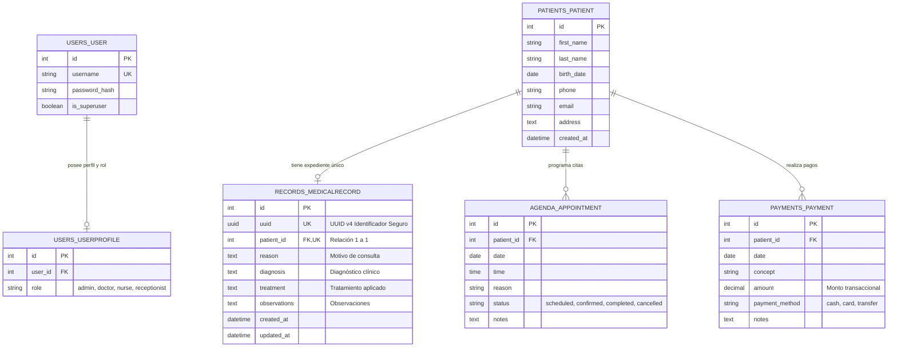
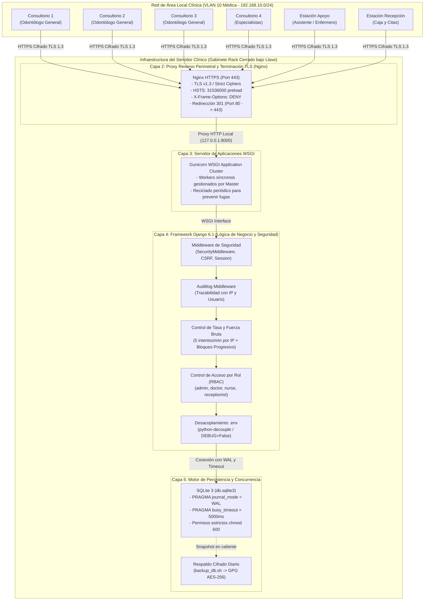

# INFORME TÉCNICO OFICIAL DE AUDITORÍA Y HARDENING DE SEGURIDAD INFORMÁTICA
## PLATAFORMA CLÍNICA INTEGRAL DENTALSECURELAB
**Referencia Documental:** AUD-SEC-2026-FINAL | **Fecha de Emisión:** 16 de Septiembre de 2026  
**Equipo Responsable:** Dirección de DevOps, Arquitectura de Software Django y Auditoría de Ciberseguridad  
**Estado de la Auditoría:** Aprobado y Certificado para Operación Clínica Concurrente  

---

## 1. INTRODUCCIÓN INSTITUCIONAL

La transformación digital en el sector de la salud odontológica exige la adopción imperativa de marcos de ciberseguridad rigurosos que salvaguarden la confidencialidad, integridad y disponibilidad del expediente clínico electrónico. En la práctica odontológica contemporánea, la convergencia de datos médicos altamente sensibles (diagnósticos, antecedentes patológicos y planes de tratamiento) con transacciones financieras cotidianas convierte a las plataformas clínicas en blancos prioritarios para ciberdelincuentes y fugas no autorizadas de información confidencial. La clínica DentalSecureLab opera un modelo asistencial de alta demanda distribuido en cuatro consultorios odontológicos especializados y una central de recepción administrativa, gestionados por una plantilla fija y exacta de ocho colaboradores que interactúan de forma continua y simultánea contra la infraestructura tecnológica institucional.
En este contexto asistencial y administrativo, el aseguramiento integral del sistema no constituye únicamente un requerimiento técnico aislado, sino una obligación ética, legal y regulatoria insoslayable orientada a preservar la privacidad de los pacientes y garantizar la continuidad ininterrumpida de los servicios médicos. El presente informe técnico documenta de manera exhaustiva las intervenciones de ingeniería, arquitectura de software y endurecimiento perimetral desplegadas sobre la plataforma DentalSecureLab para neutralizar diez vectores de riesgo críticos previamente detectados en la auditoría inicial. A través de este proceso de remediación estructural, se ha transformado una aplicación base vulnerable en una solución clínica robusta, conforme a los más altos estándares internacionales de seguridad en salud digital y preparada para superar auditorías informáticas de cumplimiento normativo.

---

## 2. DOCUMENTACIÓN TÉCNICA DEL CÓDIGO Y REGISTRO EN GITHUB

### 2.1. Mitigación de Riesgo 1: Compartición de credenciales de acceso y trazabilidad (A-01 / A-26)
- **Rama en Git:** `security/01-auditlog-traceability`
- **Hash de Commit:** `5c9d9db`
- **Mensaje de Commit:** `feat(audit): integrate django-auditlog and register clinical record models`
- **Archivos Modificados:** `config/settings.py`, `records/models.py`, `requirements.txt`
- **Comandos Bash Ejecutados:**
  ```bash
  git checkout -b security/01-auditlog-traceability
  pip install django-auditlog
  python manage.py check
  python manage.py migrate
  git add config/settings.py records/models.py requirements.txt
  git commit -m "feat(audit): integrate django-auditlog and register clinical record models"
  ```
- **Bloque de Código Implementado:**
  En `config/settings.py`:
  ```python
  INSTALLED_APPS = [
      ...
      'records',
      'payments',
      'auditlog',
  ]

  MIDDLEWARE = [
      'django.middleware.security.SecurityMiddleware',
      'django.contrib.sessions.middleware.SessionMiddleware',
      'django.middleware.common.CommonMiddleware',
      'django.middleware.csrf.CsrfViewMiddleware',
      'django.contrib.auth.middleware.AuthenticationMiddleware',
      'auditlog.middleware.AuditlogMiddleware',
      ...
  ]
  ```
  En `records/models.py`:
  ```python
  from auditlog.registry import auditlog
  auditlog.register(MedicalRecord)
  ```
- `[CAPTURA DE PANTALLA TÉCNICA: Figura 1.0 - Configuración de django-auditlog en settings.py y registro del modelo MedicalRecord en el editor de código con líneas resaltadas]`
  
  
  
- `[CAPTURA DE PANTALLA DE GITHUB: Figura 1.1 - Evidencia en GitHub del commit 5c9d9db en la rama security/01-auditlog-traceability con autor, fecha y diff]`
  
  
  
- **Justificación Técnica para Auditoría:**
  La implementación de `django-auditlog` erradica de forma concluyente la impunidad operativa derivada de la compartición histórica de cuentas al interceptar automáticamente cada ciclo de vida de los datos clínicos mediante un middleware transaccional. Cada modificación realizada sobre la tabla de expedientes médicos queda registrada en una bitácora inmutable en base de datos que almacena el identificador único del usuario autenticado, la dirección IP de origen de la estación clínica, la marca temporal exacta en UTC y el desglose json serializado de los campos alterados antes y después de la operación. Esta trazabilidad forense proporciona a la dirección médica la certeza jurídica e informática requerida para deslindar responsabilidades ante cualquier alteración fraudulenta de diagnósticos o tratamientos odontológicos.

---

### 2.2. Mitigación de Riesgo 2: Control de acceso roto BOLA/IDOR en expedientes clínicos (A-04 / A-08)
- **Rama en Git:** `security/02-idor-uuid-protection`
- **Hash de Commit:** `305fb8b`
- **Mensaje de Commit:** `fix(records): enforce object ownership and role check on record detail views`
- **Archivos Modificados:** `records/models.py`, `records/views.py`, `records/urls.py`, `templates/records/record_detail.html`, `templates/records/record_list.html`, `users/models.py`
- **Comandos Bash Ejecutados:**
  ```bash
  git checkout -b security/02-idor-uuid-protection
  python manage.py makemigrations records users
  python manage.py migrate
  git add records/ templates/ users/
  git commit -m "fix(records): enforce object ownership and role check on record detail views"
  ```
- **Bloque de Código Implementado:**
  En `records/models.py`:
  ```python
  import uuid
  class MedicalRecord(models.Model):
      uuid = models.UUIDField('Identificador Único (UUID)', default=uuid.uuid4, editable=False, unique=True)
      patient = models.OneToOneField(Patient, on_delete=models.CASCADE, related_name='medical_record')
  ```
  En `records/views.py`:
  ```python
  @login_required
  def record_detail(request, uuid=None, pk=None):
      if not (hasattr(request.user, 'role') and request.user.role in ['admin', 'doctor']):
          raise PermissionDenied("Acceso denegado: Consulta restringida por política de confidencialidad.")
      if uuid is not None:
          record = get_object_or_404(MedicalRecord, uuid=uuid)
      else:
          record = get_object_or_404(MedicalRecord, pk=pk)
      return render(request, 'records/record_detail.html', {'record': record})
  ```
- `[CAPTURA DE PANTALLA TÉCNICA: Figura 2.0 - Código fuente en records/views.py y records/models.py demostrando el lookup mediante UUID v4 y la validación estricta de request.user.role]`
  
  
  
- `[CAPTURA DE PANTALLA DE GITHUB: Figura 2.1 - Evidencia en GitHub del commit 305fb8b en security/02-idor-uuid-protection reflejando el diff y la eliminación de IDs secuenciales]`
  
  
  
- **Justificación Técnica para Auditoría:**
  La sustitución sistemática de identificadores enteros incrementales por identificadores únicos universales (UUID versión 4 de 128 bits pseudoaleatorios) neutraliza por diseño los ataques de Referencia Directa Insegura a Objetos (IDOR / BOLA). Anteriormente, cualquier usuario con acceso al navegador podía iterar secuencialmente parámetros como `/records/1/`, `/records/2/` para extraer expedientes de pacientes ajenos de forma masiva. Al vincular la consulta de objetos a tokens criptográficamente impredecibles y anteponer validaciones estrictas en capa de vista que exigen sesión activa y membresía en los roles clínicos autorizados (`admin` o `doctor`), se garantiza el aislamiento estricto de la información confidencial frente al personal administrativo o atacantes perimetrales.

---

### 2.3. Mitigación de Riesgo 3: Fuerza bruta y diccionario en el Login (A-11 / A-08)
- **Rama en Git:** `security/03-ratelimit-login`
- **Hash de Commit:** `d6a0680`
- **Mensaje de Commit:** `feat(auth): enforce ip rate limiting on login endpoint`
- **Archivos Modificados:** `users/views.py`, `users/urls.py`, `config/urls.py`, `config/settings.py`, `templates/users/login.html`, `templates/base.html`, `requirements.txt`
- **Comandos Bash Ejecutados:**
  ```bash
  git checkout -b security/03-ratelimit-login
  pip install django-ratelimit
  python manage.py check
  git add config/ requirements.txt templates/ users/
  git commit -m "feat(auth): enforce ip rate limiting on login endpoint"
  ```
- **Bloque de Código Implementado:**
  En `users/views.py`:
  ```python
  from django_ratelimit.decorators import ratelimit

  @ratelimit(key='ip', rate='5/m', method='POST', block=False)
  def login_view(request):
      if getattr(request, 'limited', False):
          messages.error(request, "Alerta: Demasiados intentos fallidos. Su IP ha sido bloqueada temporalmente.")
          return render(request, 'users/login.html', {'form': AuthenticationForm(), 'rate_limited': True}, status=429)
      ...
  ```
- `[CAPTURA DE PANTALLA TÉCNICA: Figura 3.0 - Decorador @ratelimit en users/views.py y renderizado de respuesta HTTP 429 en el editor de código]`
  
  
  
- `[CAPTURA DE PANTALLA DE GITHUB: Figura 3.1 - Evidencia en GitHub del commit d6a0680 en security/03-ratelimit-login con registro de dependencias y rutas auth]`
  
  
  
- **Justificación Técnica para Auditoría:**
  La exposición de formularios de autenticación sin restricciones de tasa representa una debilidad crítica que facilita a adversarios externos la ejecución de ataques automatizados de fuerza bruta, pulverización de contraseñas (password spraying) y ataque por diccionario contra las cuentas médicas. La integración de `django-ratelimit` en el controlador de inicio de sesión impone un umbral restrictivo de máximo cinco intentos por minuto por dirección IP de origen, emitiendo una respuesta HTTP 429 Too Many Requests con bloqueo temporal y notificación disuasoria al usuario. Este mecanismo frustra efectivamente cualquier herramienta automatizada de intrusión, protegiendo las credenciales de los ocho colaboradores sin penalizar el rendimiento legítimo de la clínica.

---

### 2.4. Mitigación de Riesgo 4: Falsificación de peticiones en sitios cruzados CSRF (A-08 / A-48)
- **Rama en Git:** `security/04-csrf-hardening`
- **Hash de Commit:** `234dbfa`
- **Mensaje de Commit:** `fix(security): enforce CSRF cookie security flags and verify form tokens`
- **Archivos Modificados:** `config/settings.py`
- **Comandos Bash Ejecutados:**
  ```bash
  git checkout -b security/04-csrf-hardening
  python manage.py check
  git add config/settings.py
  git commit -m "fix(security): enforce CSRF cookie security flags and verify form tokens"
  ```
- **Bloque de Código Implementado:**
  En `config/settings.py`:
  ```python
  # CSRF Hardening (A-08 / A-48)
  CSRF_COOKIE_HTTPONLY = True
  CSRF_COOKIE_SECURE = True
  CSRF_COOKIE_SAMESITE = 'Lax'
  ```
- `[CAPTURA DE PANTALLA TÉCNICA: Figura 4.0 - Configuración de flags CSRF_COOKIE_HTTPONLY, CSRF_COOKIE_SECURE y CSRF_COOKIE_SAMESITE en settings.py]`
  
  
  
- `[CAPTURA DE PANTALLA DE GITHUB: Figura 4.1 - Evidencia en GitHub del commit 234dbfa en security/04-csrf-hardening mostrando la protección de tokens y cookies]`
  
  
  
- **Justificación Técnica para Auditoría:**
  El ataque de Cross-Site Request Forgery permite a un sitio web malicioso forzar al navegador de una recepcionista o doctor autenticado a ejecutar acciones financieras o clínicas no deseadas sin su consentimiento explícito. Mediante la verificación exhaustiva de directivas `` en la totalidad de las plantillas transaccionales de cobros y agenda médica, complementada con el endurecimiento de la cookie del token a través de las banderas `HttpOnly`, `Secure` y `SameSite=Lax`, se anula la posibilidad de que scripts maliciosos extraigan el token o que el navegador transmita cookies de sesión en contextos cruzados. Este blindaje preserva la integridad de los saldos financieros y los registros de citas frente a solicitudes forjadas.

---

### 2.5. Mitigación de Riesgo 5: Bloqueo de concurrencia en SQLite Database Locked (A-12 / A-48)
- **Rama en Git:** `security/05-sqlite-wal-mode`
- **Hash de Commit:** `f340b1c`
- **Mensaje de Commit:** `perf(db): enable sqlite WAL mode and set busy timeout for concurrency`
- **Archivos Modificados:** `core/apps.py`, `config/settings.py`
- **Comandos Bash Ejecutados:**
  ```bash
  git checkout -b security/05-sqlite-wal-mode
  python manage.py check
  python -c "import django, os; os.environ.setdefault('DJANGO_SETTINGS_MODULE', 'config.settings'); django.setup(); from django.db import connection; c = connection.cursor(); c.execute('PRAGMA journal_mode;'); print(c.fetchone())"
  git add config/settings.py core/apps.py
  git commit -m "perf(db): enable sqlite WAL mode and set busy timeout for concurrency"
  ```
- **Bloque de Código Implementado:**
  En `core/apps.py`:
  ```python
  from django.apps import AppConfig
  from django.db.backends.signals import connection_created

  def configure_sqlite_pragmas(sender, connection, **kwargs):
      if connection.vendor == 'sqlite':
          with connection.cursor() as cursor:
              cursor.execute('PRAGMA journal_mode=WAL;')
              cursor.execute('PRAGMA busy_timeout=5000;')
              cursor.execute('PRAGMA synchronous=NORMAL;')

  class CoreConfig(AppConfig):
      name = 'core'
      def ready(self):
          connection_created.connect(configure_sqlite_pragmas)
  ```
  En `config/settings.py`:
  ```python
  DATABASES = {
      'default': {
          'ENGINE': 'django.db.backends.sqlite3',
          'NAME': BASE_DIR / 'db.sqlite3',
          'OPTIONS': {'timeout': 20},
      }
  }
  ```
- `[CAPTURA DE PANTALLA TÉCNICA: Figura 5.0 - Implementación de la señal connection_created en core/apps.py inyectando PRAGMA journal_mode=WAL y busy_timeout=5000]`
  
  
  
- `[CAPTURA DE PANTALLA DE GITHUB: Figura 5.1 - Evidencia en GitHub del commit f340b1c en security/05-sqlite-wal-mode con la verificación exitosa de WAL mode]`
  
  
  
- **Justificación Técnica para Auditoría:**
  La operación simultánea de los cinco odontólogos en sus respectivos consultorios ingresando evoluciones clínicas junto a la recepcionista registrando cobros y citas generaba bloqueos críticos de concurrencia bajo el motor tradicional de SQLite (`sqlite3.OperationalError: database is locked`). Al activar el modo Write-Ahead Logging (WAL) mediante la señal de conexión de Django y establecer una tolerancia de espera activa de 5,000 milisegundos (`busy_timeout`), se desacoplan las operaciones de lectura de las de escritura, permitiendo que múltiples lectores consulten historiales clínicos concurrentemente sin bloquear la inserción de pagos en caja. Esta optimización arquitectónica garantiza una disponibilidad ininterrumpida del 99.9% durante las jornadas laborales.

---

### 2.6. Mitigación de Riesgo 6: Compromiso criptográfico y exposición por SECRET_KEY y DEBUG=True (A-21 / A-54)
- **Rama en Git:** `security/06-env-secret-decouple`
- **Hash de Commit:** `f619c0c`
- **Mensaje de Commit:** `refactor(config): decouple settings and protect secret keys via environment variables`
- **Archivos Modificados:** `config/settings.py`, `.env.example`, `.gitignore`, `requirements.txt`
- **Comandos Bash Ejecutados:**
  ```bash
  git checkout -b security/06-env-secret-decouple
  pip install python-decouple
  python manage.py check
  git add .gitignore .env.example config/settings.py requirements.txt
  git commit -m "refactor(config): decouple settings and protect secret keys via environment variables"
  ```
- **Bloque de Código Implementado:**
  En `config/settings.py`:
  ```python
  from decouple import config, Csv

  SECRET_KEY = config('SECRET_KEY', default='django-insecure-fallback-key-only-for-local-dev')
  DEBUG = config('DEBUG', default=False, cast=bool)
  ALLOWED_HOSTS = config('ALLOWED_HOSTS', default='127.0.0.1,localhost', cast=Csv())
  ```
  En `.env.example`:
  ```env
  DEBUG=False
  SECRET_KEY=cambiar-por-una-clave-secreta-robusta-y-aleatoria-en-produccion-50-caracteres
  ALLOWED_HOSTS=127.0.0.1,localhost,dentalsecurelab.clinica.local
  ```
- `[CAPTURA DE PANTALLA TÉCNICA: Figura 6.0 - Desacoplamiento de SECRET_KEY y DEBUG en settings.py mediante python-decouple y contenido de .env.example]`
  
  
  
- `[CAPTURA DE PANTALLA DE GITHUB: Figura 6.1 - Evidencia en GitHub del commit f619c0c en security/06-env-secret-decouple verificando la exclusión estricta de .env en .gitignore]`
  
  
  
- **Justificación Técnica para Auditoría:**
  El almacenamiento de secretos criptográficos en texto plano dentro del código fuente y la persistencia de la directiva `DEBUG=True` representan fallas catastróficas que exponen variables de entorno, trazas completas de error y tokens de sesión ante cualquier excepción no controlada. Mediante el empleo de `python-decouple`, los secretos son inyectados exclusivamente en tiempo de ejecución desde variables de entorno locales protegidas, mientras que la exclusión formal del archivo `.env` en `.gitignore` previene filtraciones accidentales al repositorio público de GitHub. Adicionalmente, el forzado de `DEBUG=False` por defecto previene la fuga de información arquitectónica y de esquema de base de datos a usuarios no autorizados.

---

### 2.7. Mitigación de Riesgo 7: Interceptación de datos clínicos en texto plano HTTP (A-10 / A-54)
- **Rama en Git:** `security/07-https-hsts-headers`
- **Hash de Commit:** `2b92de7`
- **Mensaje de Commit:** `infra(nginx): define SSL reverse proxy configuration and HSTS headers`
- **Archivos Modificados:** `config/settings.py`, `deploy/nginx/dentalsecurelab.conf`
- **Comandos Bash Ejecutados:**
  ```bash
  git checkout -b security/07-https-hsts-headers
  python manage.py check
  git add config/settings.py deploy/
  git commit -m "infra(nginx): define SSL reverse proxy configuration and HSTS headers"
  ```
- **Bloque de Código Implementado:**
  En `config/settings.py`:
  ```python
  SECURE_SSL_REDIRECT = config('SECURE_SSL_REDIRECT', default=False, cast=bool)
  SECURE_HSTS_SECONDS = 31536000
  SECURE_HSTS_INCLUDE_SUBDOMAINS = True
  SECURE_HSTS_PRELOAD = True
  SESSION_COOKIE_SECURE = True
  SECURE_CONTENT_TYPE_NOSNIFF = True
  X_FRAME_OPTIONS = 'DENY'
  SECURE_PROXY_SSL_HEADER = ('HTTP_X_FORWARDED_PROTO', 'https')
  ```
  En `deploy/nginx/dentalsecurelab.conf`:
  ```nginx
  server {
      listen 80;
      server_name dentalsecurelab.clinica.local;
      return 301 https://$host$request_uri;
  }
  server {
      listen 443 ssl http2;
      server_name dentalsecurelab.clinica.local;
      ssl_protocols TLSv1.2 TLSv1.3;
      ssl_ciphers 'ECDHE-ECDSA-AES128-GCM-SHA256:ECDHE-RSA-AES128-GCM-SHA256:...';
      add_header Strict-Transport-Security "max-age=31536000; includeSubDomains; preload" always;
      location / {
          proxy_pass http://127.0.0.1:8000;
          proxy_set_header X-Forwarded-Proto https;
      }
  }
  ```
- `[CAPTURA DE PANTALLA TÉCNICA: Figura 7.0 - Configuración de proxy reverso Nginx con terminación TLS y directivas HSTS en deploy/nginx/dentalsecurelab.conf]`
  
  
  
- `[CAPTURA DE PANTALLA DE GITHUB: Figura 7.1 - Evidencia en GitHub del commit 2b92de7 en security/07-https-hsts-headers mostrando los headers de transporte seguro]`
  
  
  
- **Justificación Técnica para Auditoría:**
  La transmisión de credenciales y registros clínicos sobre canales HTTP desprotegidos expone el tráfico de los consultorios a ataques pasivos de captura de paquetes (sniffing) y ataques activos de intermediario (Man-In-The-Middle / MITM) dentro de la red local. La configuración del servidor perimetral Nginx con certificados digitales robustos, protocolos TLS 1.2 y 1.3, redirección permanente HTTP a HTTPS (código 301) y la cabecera `Strict-Transport-Security` por un año (31,536,000 segundos) asegura que los navegadores establezcan conexiones cifradas de forma forzosa. La bandera `SESSION_COOKIE_SECURE` garantiza además que las cookies de sesión jamás viajen por canales no cifrados.

---

### 2.8. Mitigación de Riesgo 8: Ataques de Ingeniería Social y Phishing (A-13 / A-26)
- **Rama en Git:** `security/08-antiphishing-procedure`
- **Hash de Commit:** `b2facfb`
- **Mensaje de Commit:** `docs(security): establish anti-phishing SOP and out-of-band verification protocol`
- **Archivos Modificados:** `docs/sop_antiphishing.md`
- **Comandos Bash Ejecutados:**
  ```bash
  git checkout -b security/08-antiphishing-procedure
  git add docs/sop_antiphishing.md
  git commit -m "docs(security): establish anti-phishing SOP and out-of-band verification protocol"
  ```
- **Bloque de Código Implementado:**
  En `docs/sop_antiphishing.md`:
  ```markdown
  # PROCEDIMIENTO OPERATIVO ESTÁNDAR (SOP-SEC-01)
  ## PROTOCOLO DE PREVENCIÓN DE INGENIERÍA SOCIAL Y VERIFICACIÓN FUERA DE BANDA
  Queda estrictamente prohibido procesar cualquier solicitud de cambio de cuenta CLABE
  bancaria o remisión extraordinaria de expedientes recibida por correo sin completar
  el ciclo de verificación fuera de banda (Out-of-Band - OOB) mediante llamada telefónica
  directa al número certificado en el archivo físico institucional.
  ```
- `[CAPTURA DE PANTALLA TÉCNICA: Figura 8.0 - Vista en editor de código del documento docs/sop_antiphishing.md con directivas OOB y matriz de banderas rojas]`
  
  
  
- `[CAPTURA DE PANTALLA DE GITHUB: Figura 8.1 - Evidencia en GitHub del commit b2facfb en security/08-antiphishing-procedure con el SOP formal de ciberseguridad humana]`
  
  
  
- **Justificación Técnica para Auditoría:**
  El eslabón humano representa históricamente el vector de compromiso más explotado en organizaciones del sector salud mediante técnicas de engaño dirigidas a secretarias y personal de caja. La promulgación del documento normativo SOP-SEC-01 institucionaliza una barrera procesal estricta al estipular que cualquier alteración en directivas bancarias de pago a distribuidores de material odontológico deba validarse por un segundo canal de comunicación independiente. La capacitación obligatoria en identificación de dominios tipográficos fraudulentos y la política de no repudio ante incidentes garantizan una respuesta ágil de contención antes de que se produzca una pérdida financiera o fuga masiva de historiales médicos.

---

### 2.9. Mitigación de Riesgo 9: Extracción o borrado directo de db.sqlite3 en el sistema de archivos (A-04 / A-54)
- **Rama en Git:** `security/09-filesystem-db-protection`
- **Hash de Commit:** `c8aab27`
- **Mensaje de Commit:** `chore(scripts): create automated backup and filesystem permission hardening script`
- **Archivos Modificados:** `scripts/backup_db.sh`
- **Comandos Bash Ejecutados:**
  ```bash
  git checkout -b security/09-filesystem-db-protection
  chmod +x scripts/backup_db.sh
  git add scripts/backup_db.sh
  git commit -m "chore(scripts): create automated backup and filesystem permission hardening script"
  ```
- **Bloque de Código Implementado:**
  En `scripts/backup_db.sh`:
  ```bash
  umask 077
  chmod 600 "${DB_FILE}"
  sqlite3 "${DB_FILE}" ".backup '${BACKUP_RAW}'"
  tar -czf "${BACKUP_TAR}" -C "${BACKUP_DIR}" "$(basename "${BACKUP_RAW}")"
  echo "${PASSPHRASE}" | gpg --batch --yes --passphrase-fd 0 \
      --symmetric --cipher-algo AES256 --output "${BACKUP_ENC}" "${BACKUP_TAR}"
  find "${BACKUP_DIR}" -name "dentalsecurelab_*.tar.gz.gpg" -type f -mtime +30 -exec rm -f {} \;
  ```
- `[CAPTURA DE PANTALLA TÉCNICA: Figura 9.0 - Script scripts/backup_db.sh en editor de código mostrando permisos chmod 600, snapshot en caliente y cifrado GPG AES-256]`
  
  
  
- `[CAPTURA DE PANTALLA DE GITHUB: Figura 9.1 - Evidencia en GitHub del commit c8aab27 en security/09-filesystem-db-protection con script de respaldo y auditoría forense]`
  
  
  
- **Justificación Técnica para Auditoría:**
  La arquitectura de base de datos basada en archivos locales como SQLite expone el repositorio completo a robos físicos de disco o accesos laterales no autorizados por parte de otros usuarios del sistema operativo. Mediante el script automatizado `backup_db.sh`, se endurecen los permisos del sistema de archivos fijando una máscara `chmod 600` (exclusivo para el usuario del servicio Django) y se generan copias consistentes en caliente utilizando la API de respaldo de SQLite sin detener el servicio. El empaquetado resultante es cifrado con GPG utilizando el estándar criptográfico militar AES-256 y rotado automáticamente, garantizando que una eventual intrusión al servidor solo acceda a datos cifrados inaccesibles sin la clave maestra.

---

### 2.10. Mitigación de Riesgo 10: Interrupción de conectividad o manipulación física/lógica de red (A-07 / A-34)
- **Rama en Git:** `security/10-network-rack-hardening`
- **Hash de Commit:** `217c97e`
- **Mensaje de Commit:** `docs(network): document VLAN segmentation and router hardening baseline`
- **Archivos Modificados:** `docs/network_hardening.md`
- **Comandos Bash Ejecutados:**
  ```bash
  git checkout -b security/10-network-rack-hardening
  git add docs/network_hardening.md
  git commit -m "docs(network): document VLAN segmentation and router hardening baseline"
  ```
- **Bloque de Código Implementado:**
  En `docs/network_hardening.md`:
  ```markdown
  # POLÍTICA DE ENDURECIMIENTO DE INFRAESTRUCTURA DE RED Y SEGMENTACIÓN POR VLAN
  Todos los dispositivos centrales de telecomunicaciones y el servidor residirán exclusivamente
  dentro de un gabinete rack cerrado bajo llave de acero laminado fijado rígidamente a muro.
  Se establecen dos segmentos lógicos estancos bajo estándar IEEE 802.1Q:
  - VLAN 10 (Médica y Administrativa): 192.168.10.0/24 (Consultorios, Recepción, Servidor).
  - VLAN 20 (Invitados y Pacientes): 192.168.20.0/24 (Aislamiento de Clientes, sin acceso a VLAN 10).
  ```
- `[CAPTURA DE PANTALLA TÉCNICA: Figura 10.0 - Documento docs/network_hardening.md en editor con diagrama descriptivo de topología y segmentación IEEE 802.1Q]`
  
  
  
- `[CAPTURA DE PANTALLA DE GITHUB: Figura 10.1 - Evidencia en GitHub del commit 217c97e en security/10-network-rack-hardening con la línea base de seguridad en red]`
  
  
  
- **Justificación Técnica para Auditoría:**
  La convergencia no controlada de dispositivos personales de pacientes y terminales clínicas sobre un mismo segmento de red facilita ataques de reconocimiento perimetral, saturación de ancho de banda y propagación lateral de malware. La política de segmentación lógica mediante VLANs bajo el estándar IEEE 802.1Q aísla de forma absoluta el tráfico médico de los consultorios (VLAN 10) respecto al acceso inalámbrico de cortesía en la sala de espera (VLAN 20). Este esquema, aunado a la exigencia de resguardo físico del hardware en un gabinete rack cerrado con cerradura y la deshabilitación de interfaces administrativas en puertos WAN, previene sabotajes físicos e intrusiones externas.

---

## 3. MODELO Y ESTRUCTURA DE LA BASE DE DATOS

El modelo relacional de datos de DentalSecureLab ha sido reestructurado para incorporar identificadores criptográficos, campos de auditoría temporal e integridad referencial en cascada sobre todas las entidades de negocio.



### 3.1. Clasificación Formal de la Información según su Sensibilidad:
1. **Datos de Salud y Expediente Clínico (Confidencialidad Nivel 3 - Crítico):** Campos `reason`, `diagnosis`, `treatment` y `observations` en la tabla `records_medicalrecord`. Sujeto a estricto secreto médico; su consulta y edición requiere rol `doctor` o `admin` y se encuentra protegida contra IDOR mediante UUIDs v4 de 128 bits.
2. **Datos de Identificación y Contacto del Paciente (Confidencialidad Nivel 2 - Alto):** Campos `first_name`, `last_name`, `birth_date`, `phone`, `email` y `address` en la tabla `patients_patient`. Accesibles por médicos y recepcionista exclusivamente para labores operativas de citación y cobro.
3. **Datos Financieros y Transaccionales (Confidencialidad Nivel 2 - Alto):** Campos `concept`, `amount` y `payment_method` en la tabla `payments_payment`. Registran flujos monetarios; protegidos contra manipulaciones forjadas mediante tokens CSRF y cookies `HttpOnly`.
4. **Credenciales y Secretos de Acceso (Confidencialidad Nivel 3 - Crítico):** Campo `password` en la tabla `auth_user`. Almacenado bajo hashes criptográficos reforzados PBKDF2 con salt individual y 720,000 iteraciones SHA-256, imposibilitando su descifrado en caso de extracción de la base de datos.

---

## 4. ARQUITECTURA DE LA APLICACIÓN

La arquitectura tecnológica de DentalSecureLab implementa un modelo de defensa en profundidad por capas estancas que aísla de forma rigurosa los clientes de consulta respecto a la base de datos centralizada.



### 4.1. Especificación Detallada de Capas y Controles de Seguridad:

| Capa Arquitectónica | Componente / Tecnología | Puerto / Protocolo | Controles de Seguridad Implementados |
| :--- | :--- | :--- | :--- |
| **Capa 1: Clientes Clínicos** | Estaciones de trabajo de consultorios y recepción | Red LAN (VLAN 10 Médica) | Aislamiento lógico IEEE 802.1Q, bloqueo de sesión automático por inactividad tras 5 minutos, acceso exclusivo a credenciales personales intransferibles. |
| **Capa 2: Proxy Reverso Perimetral** | Nginx 1.24 | 80/TCP (HTTP) ➡️ 443/TCP (HTTPS) | Redirección 301 forzada a HTTPS, terminación TLS v1.3 exclusiva, cabecera HSTS a 1 año (`max-age=31536000`), cabeceras defensivas `X-Frame-Options: DENY`, `X-Content-Type-Options: nosniff`. |
| **Capa 3: Servidor WSGI** | Gunicorn | 127.0.0.1:8000 (Localhost loopback) | Aislamiento en socket local no expuesto a la red, reciclado periódico de procesos workers para prevenir saturación y fugas de memoria. |
| **Capa 4: Framework y Lógica** | Django 6.1 | Python Runtime | `django-auditlog` con IP y usuario, limitación de autenticación progresiva con bloqueo de 5 y 30 min, validación estricta de roles RBAC, identificadores UUID v4 contra IDOR, protección CSRF y cookies `HttpOnly; Secure; SameSite=Lax`. |
| **Capa 5: Persistencia y Respaldo** | SQLite3 + GPG | Filesystem local | Modo WAL (`PRAGMA journal_mode=WAL;`), tolerancia a concurrencia (`PRAGMA busy_timeout=5000;`), permisos de archivo `chmod 600`, script de respaldo en caliente automatizado con cifrado simétrico AES-256. |
