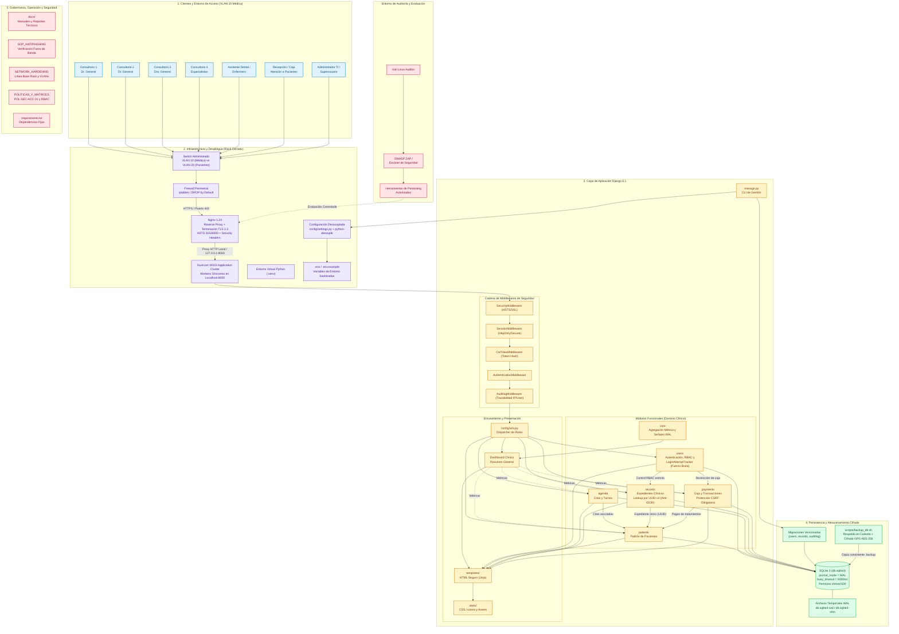
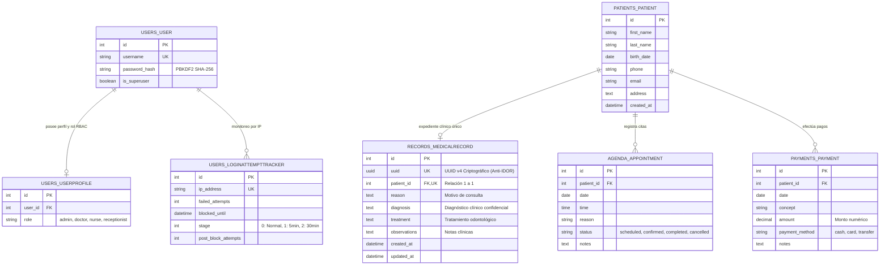

# ARQUITECTURA INTEGRAL DE LA APLICACIÓN Y SISTEMA CLÍNICO
## PLATAFORMA INTEGRAL DENTALSECURELAB
**Documento Técnico Oficial:** ARQ-SYS-2026-FINAL | **Versión:** 2.0  
**Fecha de Emisión:** 17 de Septiembre de 2026  
**Dirección Responsable:** Arquitectura de Software, Seguridad Informática y DevOps  
**Clasificación:** Confidencial - Uso Interno e Infraestructura  

---

## 1. VISIÓN GENERAL Y CONTEXTO OPERATIVO

DentalSecureLab es una plataforma web integral diseñada para la gestión clínica, administrativa y financiera de una clínica odontológica de alta demanda. La solución ha sido construida bajo el principio de **Defensa en Profundidad (Defense-in-Depth)**, garantizando que el tratamiento de datos médicos altamente sensibles (diagnósticos, antecedentes patológicos y tratamientos) y transacciones financieras se ejecuten en un entorno blindado, resiliente y de estricto cumplimiento normativo.

### Contexto Operativo y Talento Humano
El sistema opera sobre una infraestructura local distribuida que da soporte a:
* **4 Consultorios Odontológicos Especializados:** Equipados con terminales dedicadas para médicos generales y especialistas.
* **1 Central de Recepción Administrativa:** Terminal encargada de altas demográficas, agendamiento de citas y captura de cobros.
* **Plantilla Fija de 8 Colaboradores con Roles RBAC:**
  * 3 Odontólogos Generales (`doctor`).
  * 2 Especialistas Odontológicos (Endodoncia y Ortodoncia - `doctor`).
  * 1 Asistente Dental / Enfermero (`nurse` - lectura y captura asistida).
  * 1 Recepcionista (`receptionist` - caja, pacientes y citas; sin acceso a expedientes).
  * 1 Administrador de TI y Soporte (`admin` - superusuario, sin acceso a expedientes clínicos confidenciales).

---

## 2. DIAGRAMA DE ARQUITECTURA GENERAL DEL SISTEMA

El siguiente diagrama modela la arquitectura completa de extremo a extremo: clientes clínicos, entorno de evaluación, capas de infraestructura, enrutamiento, lógica de negocio Django, persistencia y gobernanza operativa.



---

## 3. ARQUITECTURA POR CAPAS (DEFENSA EN PROFUNDIDAD)

La aplicación implementa una separación estricta en **5 capas arquitectónicas**, donde cada nivel actúa como una barrera de contención independiente:

### Capa 1: Clientes y Entorno de Acceso (Terminales de Consultorio)
* **Hardware:** Estaciones de cómputo ubicadas en los 4 consultorios y recepción.
* **Seguridad de Estación:**
  * Bloqueo obligatorio por inactividad tras **5 minutos** (directiva de SO / `Windows + L`).
  * Autenticación individual intransferible; prohibición expresa de cuentas compartidas.
  * Acceso exclusivo a través del segmento `192.168.10.0/24` (**VLAN 10 Médica**).

### Capa 2: Infraestructura Perimetral y Transporte (Nginx Reverse Proxy)
* **Componente:** Servidor Nginx 1.24 alojado en Ubuntu Server dentro de un gabinete rack bajo llave.
* **Políticas de Transporte y Perímetro:**
  * **Terminación Criptográfica:** Exclusivamente **TLS v1.3** con suites de cifrado de secreto perfecto hacia adelante (PFS).
  * **Redirección Forzada:** HTTP (Puerto 80) redirigido permanentemente con código **301** hacia HTTPS (Puerto 443).
  * **Cabeceras de Seguridad Inyectadas:**
    * `Strict-Transport-Security: max-age=31536000; includeSubDomains; preload` (HSTS a 1 año).
    * `X-Frame-Options: DENY` (Mitigación total contra Clickjacking).
    * `X-Content-Type-Options: nosniff` (Mitigación de MIME-Sniffing).
  * **Aislamiento de Archivos Sensibles:** Regla de bloqueo directo en Nginx para cualquier intento de lectura a archivos con extensión `.sqlite3`, `.sh` o `.env`.

### Capa 3: Servidor de Aplicaciones WSGI (Gunicorn Application Cluster)
* **Componente:** Gunicorn ejecutándose sobre el entorno virtual (`.venv`).
* **Operación:**
  * Enlace exclusivo en interfaz local (`127.0.0.1:8000`) sin exposición directa hacia la red externa.
  * Cluster de procesos workers síncronos gestionados por un proceso Master.
  * Reciclado automático de workers para prevención de fugas de memoria y control de concurrencia.

### Capa 4: Framework Django 6.1 (Lógica de Negocio y Seguridad)
* **Stack de Middlewares en Cascada:**
  1. `SecurityMiddleware`: Fuerza HTTPS y valida cabeceras seguras.
  2. `SessionMiddleware`: Gestión de sesiones mediante cookies seguras (`Secure`, `HttpOnly`, `SameSite=Lax`).
  3. `CsrfViewMiddleware`: Verificación de tokens de protección contra peticiones falsificadas.
  4. `AuthenticationMiddleware`: Asociación de la identidad del usuario a cada solicitud HTTP.
  5. `AuditlogMiddleware`: Captura transaccional de IP del cliente, usuario y campos alterados.
* **Desacoplamiento Operativo:**
  * Gestión de secretos mediante `python-decouple` (`config()`).
  * Inexistencia de claves en código duro; archivo `.env` excluido del repositorio Git.
  * Entorno de producción certificado con `DEBUG = False`.

### Capa 5: Motor de Persistencia y Concurrencia (SQLite en Modo WAL)
* **Motor:** SQLite 3 (`db.sqlite3`).
* **Optimización de Alta Concurrencia:**
  * Modo **WAL (Write-Ahead Logging)** activado mediante la señal `connection_created` (`PRAGMA journal_mode=WAL;`).
  * Tolerancia a contención de concurrencia mediante `PRAGMA busy_timeout=5000;` (5 segundos de espera antes de error de bloqueo).
  * Permite múltiples lectores simultáneos (doctores consultando expedientes) concurrentes con escritores (recepción cobrando o doctor guardando nota médica).
* **Protección a Nivel Sistema de Archivos:**
  * Permisos restrictivos `chmod 600` sobre `db.sqlite3`, `db.sqlite3-wal` y `db.sqlite3-shm`.
  * Script automatizado [scripts/backup_db.sh](file:///c:/Users/Zephyrus/Desktop/practica/DentalSecureLab/scripts/backup_db.sh) para respaldo en caliente consistente vía `.backup` y cifrado simétrico **GPG AES-256**.

---

## 4. ARQUITECTURA DE MÓDULOS DE DOMINIO (APPS)

La plataforma está estructurada en módulos independientes y altamente cohesivos bajo el patrón MVT (Modelo - Vista - Template):

```
DentalSecureLab/
├── config/             # Orquestador del proyecto (settings.py, urls.py, wsgi.py)
├── core/               # Dashboard métrico, vista general y señales SQLite WAL
├── users/              # Autenticación, UserProfile (RBAC) y LoginAttemptTracker
├── patients/           # Maestro de pacientes y datos demográficos
├── agenda/             # Agendamiento, calendario y control de citas
├── records/            # Expedientes clínicos con identificador criptográfico UUID v4
├── payments/           # Registro de cobros, métodos de pago y validación CSRF
├── deploy/             # Configuraciones perimetrales de Nginx
├── scripts/            # Scripts de respaldo cifrado y utilidades operativas
└── docs/               # Documentación técnica, manuales y líneas base
```

### Detalle de Módulos y Controles Específicos:

| Módulo | Entidades Clave | Responsabilidad de Dominio | Controles de Seguridad Asociados |
| :--- | :--- | :--- | :--- |
| **`users`** | `User`, `UserProfile`, `LoginAttemptTracker` | Autenticación, asignación de roles y control de acceso. | Bloqueo progresivo de login (alerta en intento 2, bloqueo temporal de 5 min en intento 5 y de 30 min tras reincidencia). |
| **`records`** | `MedicalRecord` | Historial médico, diagnósticos, tratamientos y notas clínicas. | Identificador UUID v4 (neutraliza IDOR/BOLA). Restringido exclusivamente a roles `doctor` y `admin`. Auditado por `django-auditlog`. |
| **`payments`** | `Payment` | Transacciones de caja, montos, métodos de pago y recibos. | Protección estricta con token CSRF en formulario. Restringido para personal médico (exclusivo de `receptionist` y `admin`). |
| **`agenda`** | `Appointment` | Programación, confirmación y reprogramación de citas. | Validación de relaciones de clave foránea con pacientes y control de estados de cita. |
| **`patients`** | `Patient` | Registro maestro, datos demográficos y contacto. | Base relacional compartida protegida contra accesos anónimos mediante `@login_required`. |
| **`core`** | N/A (Vistas y Señales) | Panel de control central y configuración de conexión a BD. | Inyección de PRAGMAs WAL y agregación de indicadores clínicos según rol autenticado. |

---

## 5. MODELO DE DATOS Y ESQUEMA ENTIDAD-RELACIÓN

El modelo de datos relacional asegura la integridad referencial y la estricta vinculación de expedientes mediante identificadores pseudoaleatorios impredecibles:



---

## 6. FLUJO DE DATOS Y CICLO DE VIDA DE UNA PETICIÓN

El procesamiento de cualquier solicitud en DentalSecureLab sigue un pipeline riguroso y auditable:

```
[Cliente en Consultorio] (Navegador Web)
           │
           │  1. Petición HTTPS (TLS v1.3)
           ▼
[Nginx Reverse Proxy]
           │  2. Inspección TLS, cabeceras HSTS y redirección 301
           │  3. Proxy hacia 127.0.0.1:8000 con X-Forwarded-Proto
           ▼
[Gunicorn WSGI Server]
           │  4. Distribución a Worker síncrono activo
           ▼
[Django Middleware Pipeline]
           │  5. SecurityMiddleware: Validación de canal seguro
           │  6. SessionMiddleware: Carga de sesión segura
           │  7. CsrfViewMiddleware: Comprobación de token CSRF
           │  8. AuthenticationMiddleware: Carga de request.user
           │  9. AuditlogMiddleware: Captura de IP y Usuario
           ▼
[Controlador / Vista] (e.g. record_detail)
           │  10. Verificación RBAC (@login_required, request.user.role)
           │  11. Consulta por UUID v4 en MedicalRecord (Evita IDOR)
           ▼
[Django ORM]
           │  12. Señal connection_created aplica PRAGMA journal_mode=WAL
           ▼
[SQLite 3 Engine] (db.sqlite3)
           │  13. Lectura concurrente en db.sqlite3-wal sin bloquear escritores
           ▼
[Plantilla HTML]
           │  14. Renderizado seguro con escape contextual automático de variables
           ▼
[Respuesta HTTP] (Status 200 / Cookies HttpOnly + Secure + SameSite=Lax)
```

---

## 7. SEGMENTACIÓN DE RED Y TOPOLOGÍA FÍSICA

Conforme a la norma internacional **IEEE 802.1Q**, la red física de la clínica está segmentada en dos redes lógicas estancas administradas mediante switches de capa 2/3:

```
                      INTERNET
                         │
                         ▼
             [Router / Puerta de Enlace]
               (Bloqueo de Gestión WAN)
                         │
                         ▼
        [Switch Central Administrado IEEE 802.1Q]
         (Ubicado en Gabinete Rack con Llave)
            ├── Trunk
            │
    ┌───────┴────────────────────────┐
    ▼                                ▼
[VLAN 10: Médica y Operativa]   [VLAN 20: Pacientes e Invitados]
Segmento: 192.168.10.0/24       Segmento: 192.168.20.0/24
Asignación: Reserva MAC fija    Asignación: DHCP Dinámico
- Consultorios 1, 2, 3 y 4      - Wi-Fi en Sala de Espera
- Terminal de Recepción         - Client Isolation Activo
- Servidor DentalSecureLab      - Cero visibilidad a VLAN 10
```

* **Regla Estricta Inter-VLAN:** Queda bloqueado todo enrutamiento entre la VLAN 20 y la VLAN 10. Ningún dispositivo personal de un paciente puede enviar paquetes ni resolver puertos hacia el servidor clínico.
* **Gabinete Rack Físico:** Todo el hardware neurálgico (switch, router, patch panel y servidor) reside dentro de un rack metálico cerrado bajo llave de acero laminado para impedir sabotajes físicos o extracción de medios de almacenamiento.