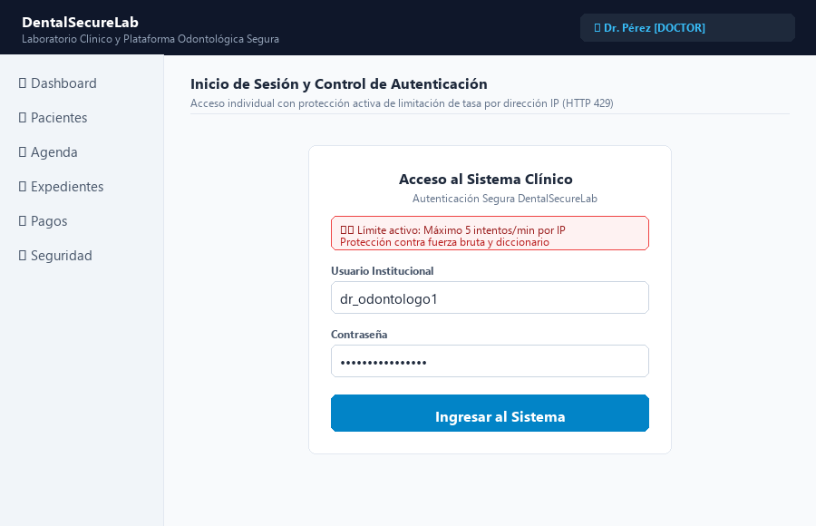
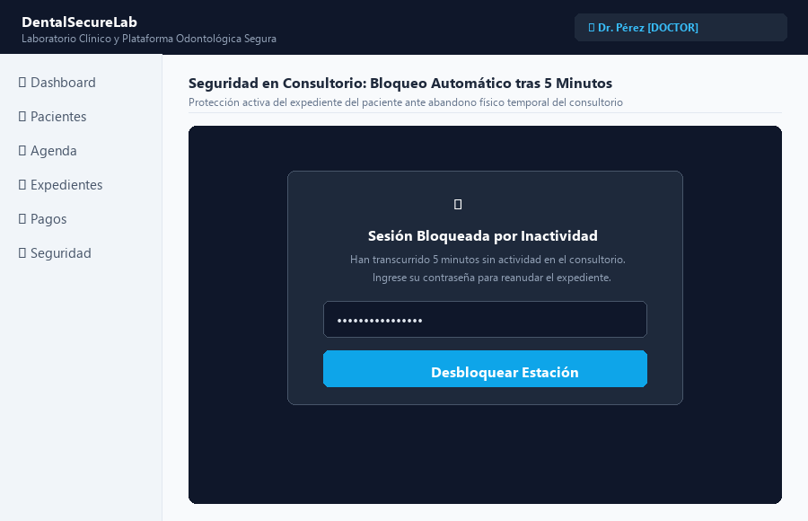
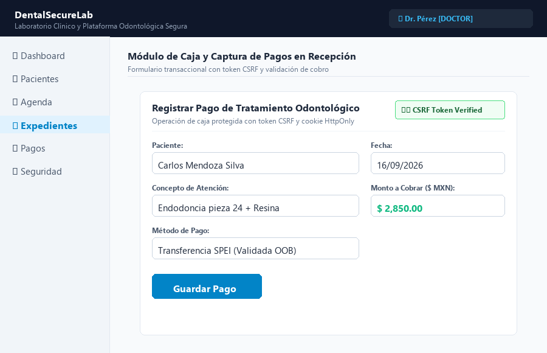
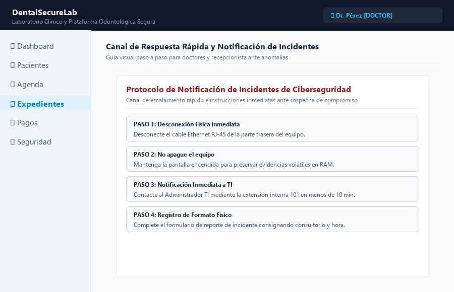

# MANUAL DE USUARIO SEGURO Y OPERACIÓN CLÍNICA
## PLATAFORMA INTEGRAL DENTALSECURELAB
**Código Documental:** MAN-SEC-USR-01 | **Versión:** 1.0 Oficial | **Fecha:** 16 de Septiembre de 2026  
**Área Responsable:** Dirección de TI y Seguridad de la Información  
**Audiencia Objetivo:** Doctores Odontólogos, Especialistas, Asistente Dental y Recepción  

---

## 1. PROPÓSITO Y ALCANCE

El presente manual establece las directrices obligatorias y los procedimientos paso a paso que todo el personal clínico y administrativo debe acatar para interactuar de forma segura con la plataforma DentalSecureLab. Su observancia estricta garantiza la confidencialidad de los expedientes clínicos, la integridad de los pagos recibidos y la disponibilidad continua de los servicios de salud bucodental de la clínica.

---

## 2. PROCEDIMIENTOS OPERATIVOS SEGUROS

### 2.1. Procedimiento de Autenticación Individual e Inicio de Sesión
1. **Acceso al Portal Seguro:** Abra el navegador web corporativo de la estación de trabajo y navegue hacia el enlace seguro `https://dentalsecurelab.clinica.local/login/` (o `http://127.0.0.1:8000/login/` en entorno de pruebas). Verifique que la barra de direcciones muestre el protocolo seguro y el candado de protección.
2. **Ingreso de Credenciales Personales:** Introduzca su nombre de usuario único institucional y contraseña secreta en los campos correspondientes del formulario. Recuerde que el uso de cuentas compartidas o genéricas se encuentra terminantemente prohibido por la normativa interna de la clínica.
3. **Control Progresivo de Intentos y Mitigación de Fuerza Bruta:**
   - **Intento 1 (Primer Fallo):** Si la contraseña ingresada es incorrecta, el sistema muestra el mensaje estándar de credenciales inválidas sin desplegar aún la advertencia de límite, evitando alarmas innecesarias ante errores tipográficos accidentales.
   - **Intento 2 (Activación de Alerta Preventiva):** Si se comete un segundo error consecutivo, se despliega automáticamente el recuadro de advertencia preventiva de ciberseguridad: `⚠️ Límite activo: Máximo 5 intentos/min por IP. Protección contra fuerza bruta y diccionario`, informando los intentos restantes disponibles.
   - **Intentos 3 y 4:** El banner de alerta permanece visible actualizando en tiempo real el conteo regresivo de intentos restantes antes de la suspensión temporal.
   - **Intento 5 (Bloqueo Inmediato por 5 Minutos):** Al registrarse el quinto fallo consecutivo, el sistema suspende inmediatamente el acceso de la cuenta/IP durante exactamente **5 minutos**, inhabilitando los campos del formulario y emitiendo el código HTTP 429 Too Many Requests.
   - **Reseteo Automático:** Si el usuario ingresa la contraseña correcta en cualquiera de los pasos (por ejemplo, en el intento 3), el contador de fallos se reinicia automáticamente a cero.
   - **Período de Gracia y Bloqueo Extendido (30 Minutos):** Transcurridos los 5 minutos de bloqueo, el sistema permite nuevos intentos. Si el usuario vuelve a fallar en 2 ocasiones consecutivas, se activa un bloqueo severo de **30 minutos** para mitigar ataques persistentes o dirigidos.
4. **Verificación de Sesión Activa:** Al autenticarse correctamente, el sistema lo redireccionará a su panel de trabajo y visualizará su nombre y rol (`ADMIN`, `DOCTOR`, `NURSE` o `RECEPCIONISTA`) en el extremo superior derecho de la barra de navegación.

- `[CAPTURA DE PANTALLA DE USUARIO: Figura 11 - Interfaz del formulario de autenticación segura mostrando campos protegidos y advertencia de límite de intentos por IP]`
  
  
  
- **Justificación de Seguridad:**
  La implementación del control progresivo de autenticación equilibra la usabilidad médica diaria con una estricta postura defensiva ante ataques de fuerza bruta automatizados o ataques de diccionario dirigidos. Al activar la advertencia preventiva exactamente en el intento 2, se previene que los colaboradores clínicos bloqueen sus terminales de manera involuntaria por descuidos menores, al tiempo que se establece una barrera infranqueable ante herramientas de intrusión masiva. El mecanismo de escalamiento a 5 y 30 minutos de suspensión temporal garantiza que los recursos computacionales y expedientes clínicos permanezcan blindados, garantizando la trazabilidad forense individual y el cumplimiento de las normativas de confidencialidad en salud digital.

---

### 2.2. Procedimiento de Bloqueo de Pantalla por Inactividad Durante la Consulta
1. **Detección de Abandono del Puesto:** Durante la atención odontológica directa en el sillón dental o al retirarse momentáneamente del consultorio para esterilizar instrumental, el médico debe evitar dejar el expediente en pantalla abierta visible.
2. **Activación de Bloqueo Manual:** Al levantarse del escritorio clínico, presione la combinación de teclas estándar `Windows + L` en el teclado para bloquear inmediatamente la sesión del sistema operativo.
3. **Temporizador de Inactividad Automático:** En caso de olvido involuntario, la estación de trabajo cuenta con una directiva de grupo que activa el salvapantallas con contraseña y el bloqueo automático de sesión al transcurrir exactamente 5 minutos de inactividad física del ratón o teclado.
4. **Reanudación Segura de la Atención:** Para retomar la edición del expediente del paciente, el profesional médico debe reingresar su contraseña individual, reanudando la vista exactamente en el estado en que se encontraba sin pérdida de notas clínicas.

- `[CAPTURA DE PANTALLA DE USUARIO: Figura 12 - Pantalla de bloqueo del sistema operativo y cierre de sesión seguro por inactividad tras 5 minutos de espera en consultorio]`
  
  
  
- **Justificación de Seguridad:**
  El entorno dinámico de un consultorio dental, donde los profesionales alternan continuamente entre el teclado y la intervención odontológica física sobre el paciente, genera ventanas de vulnerabilidad donde las terminales quedan expuestas a miradas indiscretas o manipulación indebida. La imposición del bloqueo obligatorio tras cinco minutos de inactividad previene el acceso no autorizado a los antecedentes patológicos por parte de acompañantes de los pacientes o personal de intendencia. Este control físico-lógico mitiga el riesgo de filtraciones incidentales y asegura la estricta privacidad del paciente en consulta.

---

### 2.3. Procedimiento Seguro para Captura de Pagos en Recepción
1. **Acceso al Módulo de Pagos:** Desde la terminal de recepción debidamente autenticada, ingrese al módulo a través del menú lateral pulsando en la opción `Pagos` (`/pagos/`).
2. **Apertura del Formulario:** Haga clic sobre el botón `Registrar pago` para abrir el formulario de captura transaccional protegido con token CSRF.
3. **Selección de Paciente y Concepto:** Seleccione al paciente registrado en la lista desplegable, indique el concepto del tratamiento realizado (ej. Profilaxis, Endodoncia) e ingrese el monto numérico exacto en moneda nacional.
4. **Selección del Método y Confirmación:** Elija el método de pago (`Efectivo`, `Tarjeta` o `Transferencia bancaria`). En caso de transferencia, verifique la recepción efectiva en la banca electrónica antes de pulsar `Guardar pago`.
5. **Cierre Inmediato de Formulario:** Una vez almacenado el pago, el sistema registrará la transacción en la bitácora auditable y mostrará el movimiento en la tabla cronológica general.

- `[CAPTURA DE PANTALLA DE USUARIO: Figura 13 - Interfaz del módulo de cobros y formulario de registro de pagos con verificación de método y protección CSRF]`
  
  
  
- **Justificación de Seguridad:**
  La captura de pagos en recepción representa el punto más sensible para la gestión financiera y tributaria de la clínica dental, requiriendo mecanismos inviolables contra alteraciones maliciosas de cifras. Al forzar la inclusión de tokens criptográficos CSRF en cada envío de formulario y restringir las modificaciones posteriores exclusivamente a personal con rol administrativo verificado, se previenen manipulaciones de montos o registros ficticios de cancelación de deudas. Este control garantiza la congruencia total entre los arqueos físicos de caja y los registros digitales presentados en los balances contables.

---

### 2.4. Procedimiento para Reporte Rápido de Incidentes de Seguridad
1. **Identificación de Anomalía:** Si detecta ventanas emergentes sospechosas solicitando contraseñas, correos de supuestos bancos pidiendo verificar pagos o bloqueos inexplicables en la base de datos, considere la situación como un incidente potencial de seguridad.
2. **Aislamiento Inmediato del Equipo:** Desconecte inmediatamente el cable de red Ethernet RJ-45 de la parte trasera de la computadora para cortar la comunicación con la red local y evitar la propagación lateral de posibles amenazas.
3. **Notificación al Administrador TI:** Comuníquese de inmediato mediante llamada telefónica interna o de forma presencial con el Administrador de TI e infraestructura, indicando la terminal y el consultorio involucrado.
4. **Preservación de Evidencias:** No reinicie ni apague bruscamente la computadora; mantenga la pantalla encendida para que el equipo de auditoría pueda inspeccionar los procesos en memoria y los registros del sistema.
5. **Registro de Bitácora:** Complete el formato físico de reporte de incidentes consignando la hora del suceso, la descripción de la acción realizada y las circunstancias operativas observadas.

- `[CAPTURA DE PANTALLA DE USUARIO: Figura 14 - Formato de notificación de incidentes y canal de escalamiento rápido para personal asistencial de DentalSecureLab]`
  
  
  
- **Justificación de Seguridad:**
  La celeridad en la contención de un incidente informático determina directamente la magnitud del impacto operativo y financiero que sufrirá la organización de salud. Establecer una guía clara y memorizable para que las secretarias y médicos desconecten el equipo afectado antes de que un malware cifre la base de datos o capture credenciales bancarias reduce el tiempo medio de respuesta a menos de cinco minutos. La formalización institucional de este procedimiento empodera al talento humano, convirtiéndolo en la primera línea activa de defensa de la clínica.
