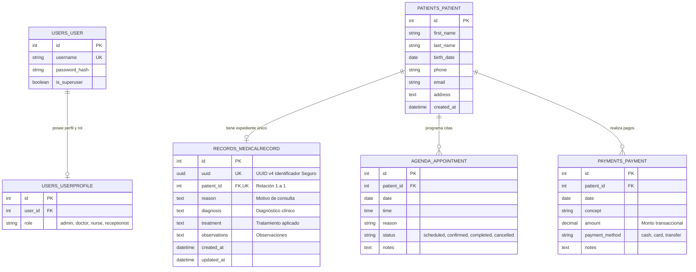

# POLÍTICAS DE ACCESO, MATRICES DE CONTROL Y CONFIGURACIÓN DEL SERVIDOR
## PLATAFORMA CLÍNICA INTEGRAL DENTALSECURELAB
**Código Normativo:** POL-SEC-MAT-01 | **Versión:** 1.0 Oficial | **Fecha:** 16 de Septiembre de 2026  
**Área Responsable:** Dirección de Ciberseguridad y Auditoría TI  
**Clasificación de Documento:** Confidencial - Uso Interno Institucional  

---

## 1. POLÍTICA DE CONTROL DE ACCESO (POL-SEC-ACC-01)

### 1.1. Cuentas Individuales e Intransferibles
Toda persona perteneciente a la clínica que requiera interactuar con la plataforma DentalSecureLab deberá contar con una cuenta de usuario individual, personal e intransferible.
Queda terminantemente prohibida la creación o utilización de cuentas genéricas tales como "consultorio", "recepcion", "enfermeria" o "doctor_turno".
El intercambio, préstamo o divulgación de contraseñas entre colaboradores se catalogará como falta grave a las políticas de seguridad institucional y ameritará revocación inmediata de privilegios y sanción administrativa.
La responsabilidad por cualquier registro, alteración o consulta efectuada bajo una sesión recaerá de forma exclusiva sobre el titular asignado a dicha cuenta en el directorio oficial.

### 1.2. Modelo de Control de Acceso Basado en Roles (RBAC)
La plataforma implementa un modelo estricto de control de acceso basado en roles (Role-Based Access Control - RBAC) en el que los privilegios son otorgados en función del principio de mínimo privilegio indispensable.
El sistema reconoce formalmente cuatro perfiles operativos: Administrador del Sistema y TI, Doctor Odontólogo / Especialista, Asistente Dental / Enfermero y Recepcionista.
El personal asignado al perfil de Recepción tiene restringido de manera absoluta el acceso lógico, de visualización o de modificación a los expedientes clínicos en `/records/`.
De forma análoga, el perfil de Administrador de TI tiene vedada la consulta a la información clínica de evolución de los pacientes, limitando sus facultades a la configuración de usuarios y mantenimiento técnico.

### 1.3. Estándar Criptográfico de Contraseñas y Caducidad
Las contraseñas de acceso deben poseer una longitud mínima obligatoria de 12 caracteres, integrando de forma combinada caracteres alfabéticos en mayúsculas y minúsculas, dígitos numéricos y al menos un carácter especial simbólico.
Queda restringido el empleo de nombres propios, secuencias consecutivas obvias (`123456`), fechas de nacimiento o palabras vinculadas a la odontología como clave secreta.
El sistema impondrá una vigencia máxima de 90 días calendario para cada contraseña, forzando su renovación obligatoria e impidiendo la reutilización de las últimas cinco claves utilizadas con anterioridad.
Los intentos fallidos continuos generarán el bloqueo temporal de la estación de origen para proteger la cuenta contra ataques automatizados de descifrado.

### 1.4. Bloqueo Automático de Pantalla por Inactividad
Toda estación de trabajo instalada en los cuatro consultorios y en la recepción deberá contar con la directiva activa de bloqueo automático de sesión al detectar 5 minutos continuos de inactividad operativa.
El colaborador médico está obligado a bloquear manualmente su equipo mediante el atajo de teclado correspondiente cada vez que se separe físicamente del escritorio de atención.
El navegador web destruirá la sesión activa de Django tras 30 minutos de inactividad global, requiriendo el reingreso de credenciales completas para reanudar operaciones.
Esta directiva mitiga la exposición no intencional de historiales médicos ante la presencia de pacientes o visitantes en los consultorios.

### 1.5. Proceso de Desvinculación Inmediata (Offboarding < 2 Horas)
Ante la desvinculación laboral, renuncia o baja temporal de cualquier colaborador de la plantilla de ocho personas, el departamento de Recursos Humanos deberá notificar formalmente al Administrador de TI en un plazo máximo de 30 minutos.
El Administrador de TI tiene la obligación técnica indelegable de inhabilitar la cuenta del usuario en la base de datos de Django en un tiempo perentorio no mayor a 2 horas tras la recepción del aviso.
El proceso de baja conlleva el marcado del atributo `is_active = False`, la eliminación inmediata de todas las sesiones abiertas en la tabla `django_session` y el cambio preventivo de claves perimetrales si el colaborador poseía accesos privilegiados.
Se generará una constancia digital en la bitácora de auditoría certificando la fecha, hora exacta y operador responsable de la inhabilitación del usuario.

### 1.6. Revisiones Periódicas de Permisos y Cuentas
La Dirección General y el Administrador de TI efectuarán una auditoría mensual obligatoria sobre el padrón total de cuentas activas registradas en la plataforma DentalSecureLab.
Cualquier cuenta que permanezca sin registrar actividad de inicio de sesión durante un lapso mayor a 45 días continuos será suspendida preventivamente por motivos de seguridad.
Se verificará que ningún colaborador cuente con roles o privilegios sobredimensionados que no se correspondan con sus funciones asistenciales vigentes en la clínica.
Los hallazgos de cada revisión periódica serán asentados en el libro de gobierno de tecnologías de la información con el visto bueno de la dirección médica.

---

## 2. MATRIZ DE USUARIOS, PERMISOS Y RESPONSABILIDADES

La siguiente matriz norma las facultades operativas de los ocho colaboradores de DentalSecureLab, divididos estrictamente en los perfiles de `Administrador`, `Doctor` y `Recepción`:

| Rol Institucional | Recurso al que Accede | Permiso / Acción Autorizada | Responsabilidad Operativa | Restricción Técnica Absoluta |
| :--- | :--- | :--- | :--- | :--- |
| **Administrador** *(1 Colaborador: Soporte y TI)* | `/admin/`, Módulos de infraestructura, gestión de usuarios y perfiles, respaldos y logs. | Lectura y escritura sobre cuentas de usuario, configuración de parámetros del servidor, ejecución de respaldos y revisión de bitácoras de auditoría técnica. | Garantizar la disponibilidad del 99.9% de la plataforma, integridad de respaldos cifrados y actualización de parches de seguridad del sistema operativo. | **Bloqueo absoluto a expedientes clínicos (`/records/`)** y notas de diagnóstico médico de pacientes bajo reserva confidencial. |
| **Doctor** *(3 Odontólogos Generales, 2 Especialistas y 1 Asistente Dental)* | `/pacientes/`, `/agenda/`, `/expedientes/` (mediante UUID seguro). | Consulta y captura de pacientes, consulta y reprogramación de citas médicas, creación, consulta y actualización de expedientes clínicos propios. | Resguardar la confidencialidad médica de los diagnósticos, registro oportuno de evoluciones y aplicación de tratamientos conforme a la lex artis. | **Bloqueo total al módulo de cobros y facturación (`/payments/`)** y restricción absoluta de acceso a configuraciones de servidor. *(Nota: El asistente opera en modo lectura/captura asistida sujeta a firma médica)*. |
| **Recepción** *(1 Colaboradora: Caja y Atención al Paciente)* | `/pacientes/`, `/agenda/`, `/pagos/`, `/login/`. | Alta y actualización de datos demográficos de pacientes, agendamiento de citas y confirmaciones, captura y emisión de recibos de pago. | Verificación de cobros en banca electrónica, resguardo del fondo físico de caja y atención cordial y oportuna en sala de espera. | **Bloqueo técnico absoluto a expedientes clínicos (`/records/`)**; cualquier intento de acceso genera excepción HTTP 403 / Denied. |

---

## 3. REGISTRO DE REGLAS DE CONFIGURACIÓN DEL SERVIDOR (10 REGLAS)

| Elemento / Parámetro | Regla Técnica Definida | Justificación Técnica de Seguridad | Evidencia Esperada de Cumplimiento |
| :--- | :--- | :--- | :--- |
| **1. Modo de Depuración** | `DEBUG = False` en entorno de producción desacoplado vía `.env`. | Previene la filtración masiva de código fuente, configuraciones internas y variables de entorno en pantallas de error visibles al usuario. | `manage.py check` sin advertencias y visualización de página HTTP 500 estándar sin trazas de código ante excepciones. |
| **2. Clave Criptográfica** | `SECRET_KEY` aleatoria de 50+ caracteres gestionada fuera del código fuente. | Evita el descifrado de firmas de sesión, alteración de cookies seguras y falsificación de tokens de restablecimiento de contraseña. | Ausencia total de la clave en el historial de Git y lectura dinámica verificada mediante `python-decouple`. |
| **3. Redirección Forzada TLS** | `SECURE_SSL_REDIRECT = True` y regla de reescritura 301 permanente en Nginx. | Impide que las estaciones de trabajo transmitan tráfico clínico en texto plano susceptible de intercepción en la red de área local. | Intento de conexión en puerto HTTP 80 devuelve código 301 con cabecera `Location: https://...`. |
| **4. Cabecera HSTS** | `SECURE_HSTS_SECONDS = 31536000` con `includeSubDomains` y `preload`. | Obliga a los navegadores web a comunicarse exclusivamente mediante HTTPS durante un año, neutralizando ataques de degradación SSL Strip. | Cabecera HTTP `Strict-Transport-Security: max-age=31536000; includeSubDomains; preload` presente en respuestas. |
| **5. Cookies de Sesión** | `SESSION_COOKIE_SECURE = True` y `SESSION_COOKIE_HTTPONLY = True`. | Garantiza que la cookie de sesión viaje exclusivamente por canales cifrados y sea inaccesible para scripts maliciosos del lado del cliente (XSS). | Atributos `Secure` y `HttpOnly` explícitamente marcados en la cabecera `Set-Cookie: sessionid=...`. |
| **6. Hardening de Cookies CSRF** | `CSRF_COOKIE_HTTPONLY = True`, `SECURE = True`, `SAMESITE = 'Lax'`. | Previene el robo del token de protección contra peticiones cruzadas y anula su transmisión en enlaces externos no confiables. | Atributos `HttpOnly; Secure; SameSite=Lax` visibles en la inspección de la cookie `csrftoken`. |
| **7. Protección de Marcos** | `X_FRAME_OPTIONS = 'DENY'` y CSP `frame-ancestors 'none'`. | Neutraliza de raíz los ataques de secuestro de clics (Clickjacking) impidiendo que la aplicación sea embebida en marcos iframe maliciosos. | Cabecera HTTP `X-Frame-Options: DENY` emitida en la totalidad de las respuestas del servidor. |
| **8. Concurrencia de Datos** | SQLite configurado con `journal_mode=WAL` y `busy_timeout=5000`. | Soporta las operaciones de escritura y lectura simultáneas de los 8 colaboradores clínicos sin bloqueos de contención de base de datos. | Ejecución de consulta `PRAGMA journal_mode;` en el motor SQLite devolviendo el valor literal `wal`. |
| **9. Tasa de Autenticación** | `django-ratelimit` configurado a 5 peticiones POST por minuto por IP en `/login/`. | Bloquea eficazmente ataques de fuerza bruta y ataques automatizados por diccionario dirigidos a vulnerar las credenciales de los médicos. | El sexto intento erróneo en menos de un minuto recibe código HTTP 429 Too Many Requests con advertencia de bloqueo. |
| **10. Protección del Archivo DB** | Permisos del sistema de archivos fijados en `chmod 600` para `db.sqlite3`. | Impide que usuarios secundarios o procesos no autorizados en el servidor puedan leer o copiar directamente el archivo de base de datos. | Listado de permisos `ls -l db.sqlite3` reflejando `-rw-------` con propiedad exclusiva para el usuario de ejecución. |

---

## 4. MATRIZ DE CONTROLES DE SEGURIDAD (10 CONTROLES TRAZABLES)

| Riesgo Mitigado | Control de Seguridad Implementado | Tipo de Control | Dónde Aplica | Implementación Técnica Concreta | Evidencia de Auditoría |
| :--- | :--- | :--- | :--- | :--- | :--- |
| **Riesgo 1 (A-01/A-26)** Compartición y trazabilidad | Registro de Auditoría Transaccional | Detectivo / Correctivo | `records/models.py`, `config/settings.py` | Middleware `AuditlogMiddleware` e integración con modelos clínicos. | Registro histórico en tabla `auditlog_logentry` con usuario, IP y diff json. |
| **Riesgo 2 (A-04/A-08)** IDOR en expedientes | Control de Acceso Criptográfico y RBAC | Preventivo | `records/views.py`, `records/urls.py` | Migración a UUID v4 y decoradores `@login_required` con verificación de rol médico. | URLs tipo `/expedientes/<uuid>/` y bloqueo con `PermissionDenied` ante otros roles. |
| **Riesgo 3 (A-11/A-08)** Fuerza bruta en login | Limitador de Tasa por Dirección IP | Preventivo | `users/views.py` | Decorador `@ratelimit(key='ip', rate='5/m', method='POST')` y bloqueo progresivo. | Bloqueo temporal y respuesta HTTP 429 tras 5 intentos fallidos consecutivos. |
| **Riesgo 4 (A-08/A-48)** Falsificación de peticiones CSRF | Validación Criptográfica de Formulario | Preventivo | `templates/`, `config/settings.py` | Token `` en formularios y banderas `HttpOnly`, `Secure`, `SameSite=Lax`. | Cabecera `Set-Cookie` con banderas estrictas y rechazo de peticiones sin token. |
| **Riesgo 5 (A-12/A-48)** Bloqueo de concurrencia | Concurrencia Write-Ahead Logging | Correctivo / Desempeño | `core/apps.py`, `config/settings.py` | Señal `connection_created` inyectando `PRAGMA journal_mode=WAL; busy_timeout=5000;`. | Archivos auxiliares `db.sqlite3-wal` creados y cero excepciones de concurrencia. |
| **Riesgo 6 (A-21/A-54)** Compromiso de credenciales | Desacoplamiento de Variables de Entorno | Preventivo | `config/settings.py`, `.env.example` | Empleo de `python-decouple`, exclusión de `.env` en Git y `DEBUG=False` por defecto. | Archivo `.env` ausente del repositorio y carga de configuraciones desde entorno. |
| **Riesgo 7 (A-10/A-54)** Interceptación en tránsito | Cifrado Extremo a Extremo TLS y HSTS | Preventivo | `deploy/nginx/`, `config/settings.py` | Proxy Nginx con TLS 1.2/1.3, redirección 301, cabecera HSTS 1 año y cookies seguras. | Conexiones forzadas por puerto 443 y cabecera `Strict-Transport-Security` activa. |
| **Riesgo 8 (A-13/A-26)** Phishing y fraude clínico | Procedimiento Operativo Estándar | Administrativo / Humano | `docs/sop_antiphishing.md` | Protocolo SOP-SEC-01 con verificación fuera de banda obligatoria para pagos y datos. | Documento normativo oficializado y acuse de enterado de la plantilla clínica. |
| **Riesgo 9 (A-04/A-54)** Fuga o robo de base de datos | Endurecimiento de Disco y Cifrado GPG | Preventivo / Correctivo | `scripts/backup_db.sh` | Permisos `chmod 600` en disco, respaldo en caliente consistente y cifrado AES-256. | Script ejecutable verificado y respaldos comprimidos `.tar.gz.gpg` en directorio seguro. |
| **Riesgo 10 (A-07/A-34)** Intrusión física de red | Aislamiento en Rack y VLANs 802.1Q | Físico / Lógico | `docs/network_hardening.md` | Gabinete rack bajo llave, desactivación de gestión WAN y segmentación VLAN Médica vs Invitados. | Diagrama de topología validado y políticas de aislamiento de red formalizadas. |

---

## 5. REFERENCIA DEL MODELO DE DATOS Y ACTIVOS PROTEGIDOS

El modelo de datos y la clasificación formal de información de la clínica que norma el acceso regulado por las políticas anteriores es el siguiente:

### Niveles de Sensibilidad de Activos:
1. **Datos de Salud y Expediente Clínico (Confidencialidad Nivel 3 - Crítico):** Secreto médico; acceso exclusivo a roles `doctor` o `admin`. Protegido contra IDOR mediante UUIDs v4.
2. **Datos Demográficos y Citas (Confidencialidad Nivel 2 - Alto):** Accesibles por médicos y recepcionista para citación y contacto.
3. **Datos Transaccionales de Cobro (Confidencialidad Nivel 2 - Alto):** Operado en recepción; protegido con tokens CSRF y cookies `HttpOnly`.
4. **Credenciales de Acceso (Confidencialidad Nivel 3 - Crítico):** Hashes criptográficos unidireccionales PBKDF2-SHA256 con salt individual.
